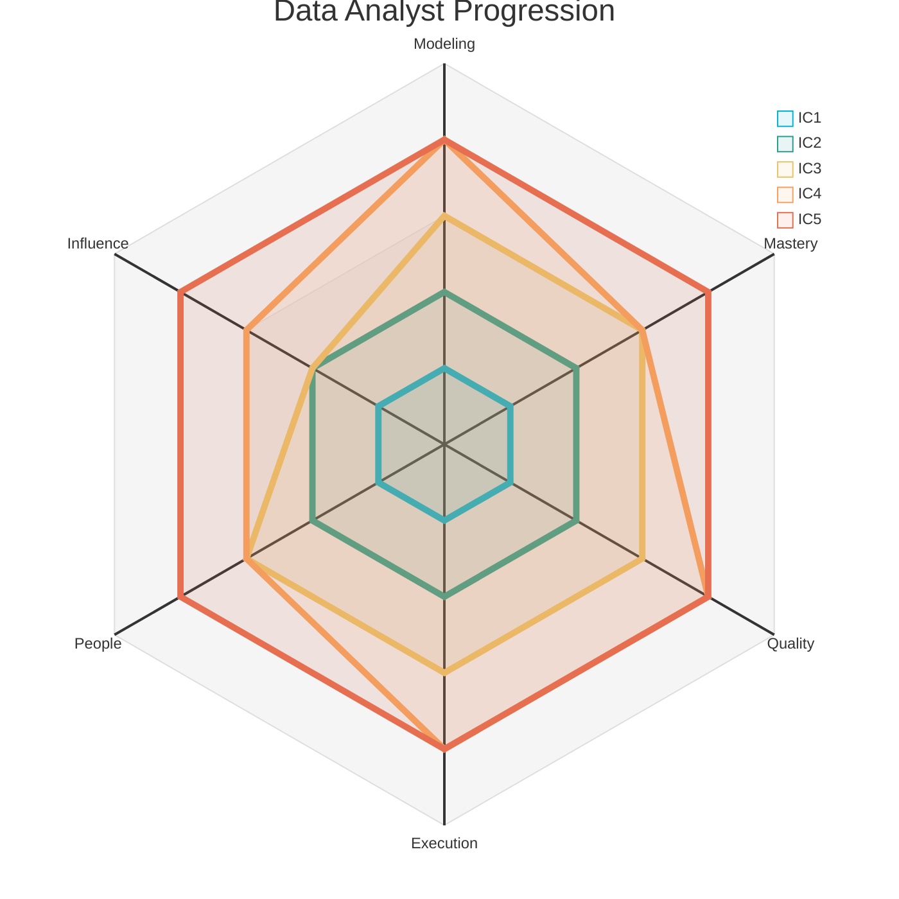
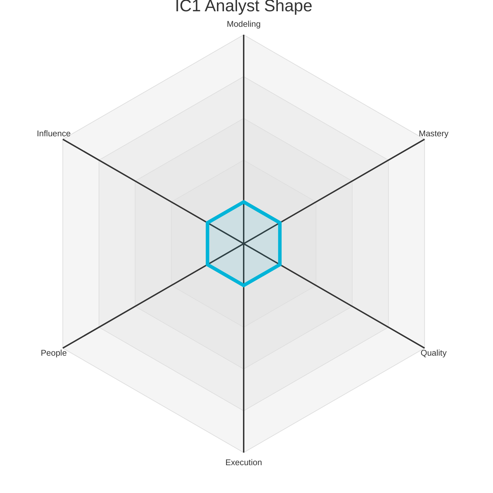
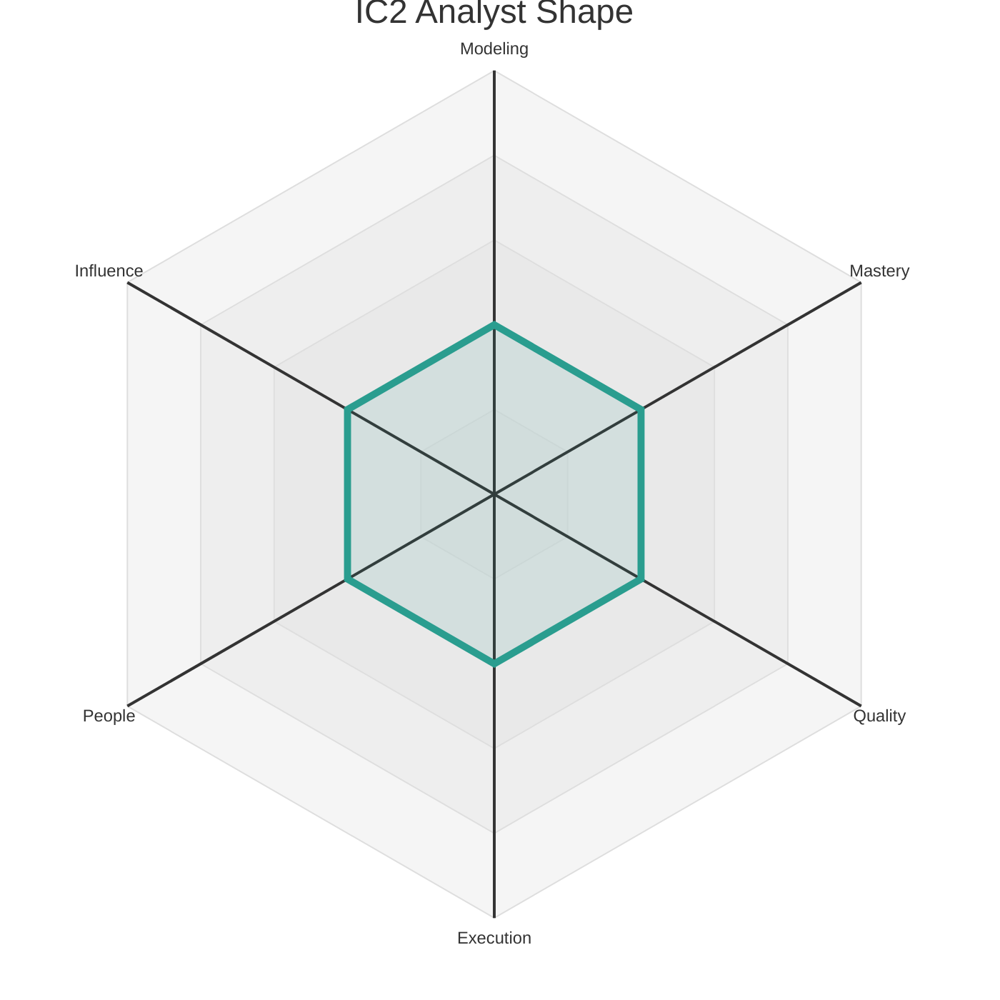
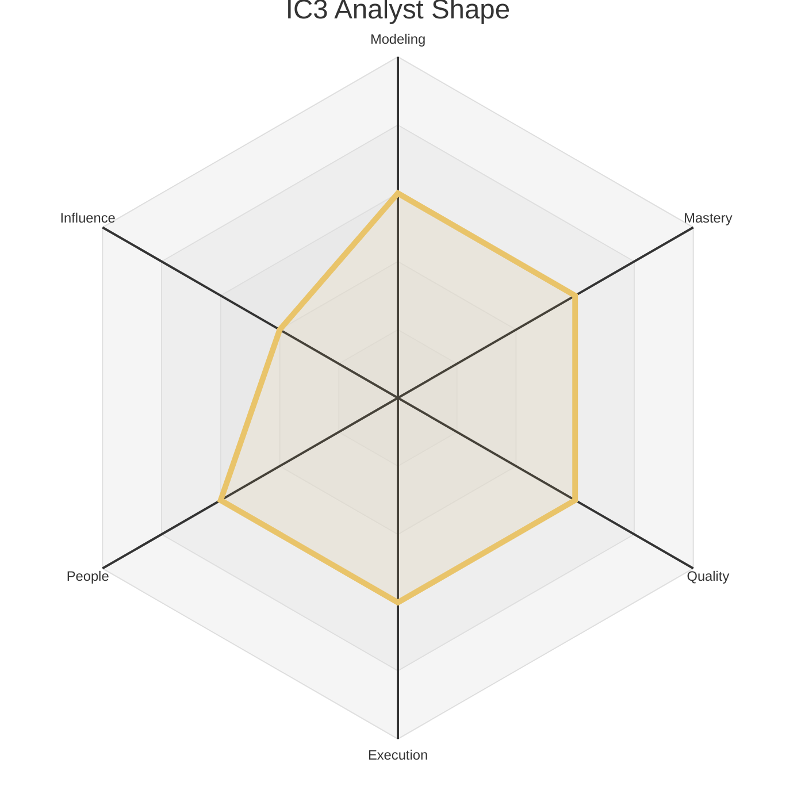
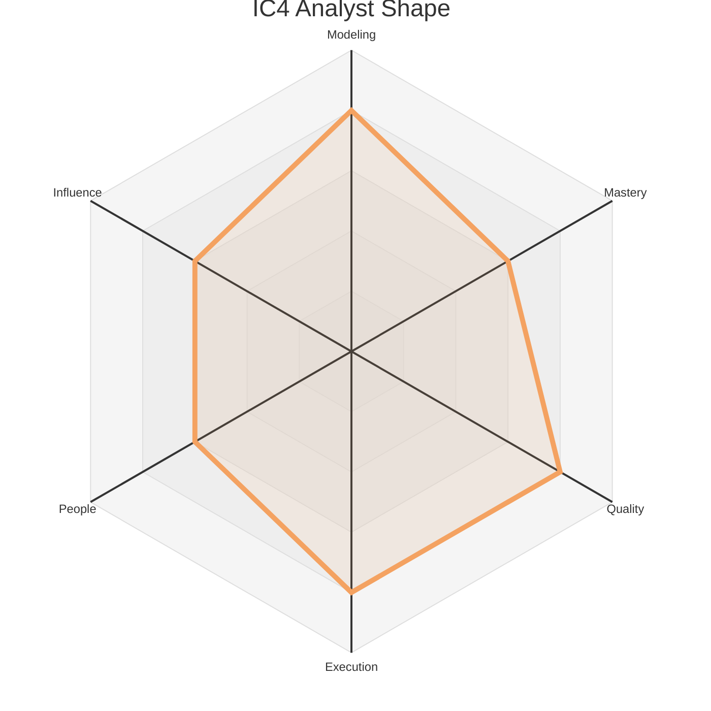
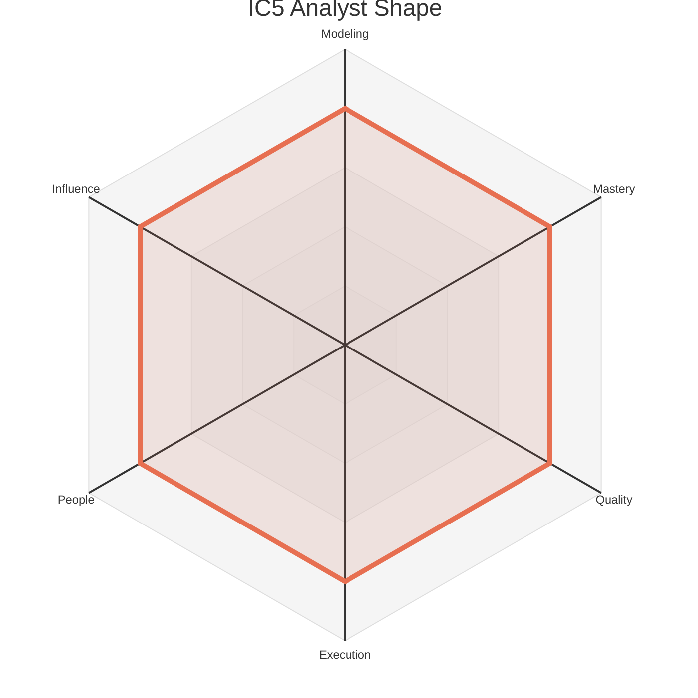

# Data Levels - Data Analyst

This document outlines the five Individual Contributor (IC) levels for a Data Analyst. Each level provides a summary of the expected scope and maps it to the corresponding levels on the six core axes defined in `axes.md`.

The radar chart below visualizes the expected competency shape at each of the five IC levels.

### Level 1: Associate Data Analyst (IC1)

*   **Summary:** A learner who **adopts** team practices to **build** dashboards and queries from well-defined requirements, focusing on developing core analytical skills under guidance.

| Axis     | Level | Description                                                                                                                                                                                                                                                         |
| :------- | :---- | :------------------------------------------------------------------------------------------------------------------------------------------------------------------------------------------------------------------------------------------------------------------ |
| Modeling | 1     | **Data Analyst:** Builds simple dashboards and queries from well-defined requirements. Focuses on learning the company's core data sources and tools.                                                                                                                   |
| Mastery  | 1     | **Data Analyst:** Learns the fundamentals of SQL and a data visualization tool (e.g., Tableau, Looker).                                                                                                                                                                  |
| Quality  | 1     | **Data Analyst:** Produces accurate and clear analyses. Relies on feedback to improve the quality of their work.                                                                                                                                                       |
| Execution| 1     | **Data Analyst:** Completes assigned analyses and reports status clearly.                                                                                                                                                                                                |
| People   | 1     | Communicates clearly with teammates and remains open to feedback, seeking help when stuck. They build trust by being reliable, listening actively in team discussions, and responding to feedback with a constructive, growth-oriented mindset.                      |
| Influence| 1     | Work primarily impacts their immediate tasks and the features they are assigned to. Their sphere of influence is their own work, and success is defined by learning how their individual contributions fit into the team's larger goals.                             |

### Level 2: Data Analyst (IC2)

*   **Summary:** A reliable contributor who **creates** insightful analyses and **masters** the core tools and data sources, ensuring their team is making data-informed decisions.

| Axis     | Level | Description                                                                                                                                                                                                                                                         |
| :------- | :---- | :------------------------------------------------------------------------------------------------------------------------------------------------------------------------------------------------------------------------------------------------------------------ |
| Modeling | 2     | **Data Analyst:** Creates insightful analyses that answer specific business questions. Can combine multiple data sources to tell a story with data.                                                                                                                   |
| Mastery  | 2     | **Data Analyst:** Is proficient in SQL and can write complex queries. Is skilled at using data visualization tools to create compelling dashboards and reports.                                                                                                        |
| Quality  | 2     | **Data Analyst:** Consistently delivers high-quality analyses that are well-documented and easy to understand.                                                                                                                                                       |
| Execution| 2     | **Data Analyst:** Can independently manage a small analytics project.                                                                                                                                                                                                |
| People   | 2     | Actively participates in team rituals. Provides respectful, constructive feedback that helps teammates improve. Is a good collaborator and informally shares knowledge, making the team more effective.                                                               |
| Influence| 2     | Contributions improve the team's ability to achieve its goals. They own analyses, pipelines, or models that their teammates depend on, and their work directly enables the team to be more effective.                                                                  |

### Level 3: Senior Data Analyst (IC3)

*   **Summary:** An analytics owner who **specializes** in a complex business domain, **proactively delivers** insights that drive strategy, and **supports** the growth of their teammates.

| Axis     | Level | Description                                                                                                                                                                                                                                                         |
| :------- | :---- | :------------------------------------------------------------------------------------------------------------------------------------------------------------------------------------------------------------------------------------------------------------------ |
| Modeling | 3     | **Data Analyst:** Owns the analytics for a specific product or business area. Proactively identifies important questions and delivers insights that drive strategy.                                                                                                     |
| Mastery  | 3     | **Data Analyst:** Is an expert in a specific domain of analytics (e.g., product analytics, marketing analytics). Has deep statistical knowledge.                                                                                                                        |
| Quality  | 3     | **Data Analyst:** Champions a culture of data quality and analytical rigor on their team.                                                                                                                                                                            |
| Execution| 3     | **Data Analyst:** Owns the analytics for a large feature or product area.                                                                                                                                                                                            |
| People   | 3     | Formally coaches teammates and other peers through thoughtful feedback, and knowledge-sharing sessions. Helps resolve team conflicts constructively, improves collaboration practices, and takes an active role in onboarding and supporting the growth of junior team members. |
| Influence| 2     | Contributions improve the team's ability to achieve its goals. They own analyses, pipelines, or models that their teammates depend on, and their work directly enables the team to be more effective.                                                                  |

### Level 4: Staff Data Analyst (IC4)

*   **Summary:** An analytics leader who **designs** a cohesive analytics strategy for a large business area, **evangelizes** data-driven decision making, and **orchestrates** major analytical projects.

| Axis     | Level | Description                                                                                                                                                                                                                                                         |
| :------- | :---- | :------------------------------------------------------------------------------------------------------------------------------------------------------------------------------------------------------------------------------------------------------------------ |
| Modeling | 4     | **Data Analyst:** Designs and implements a cohesive analytics strategy for a large part of the business. Their work influences the direction of multiple teams.                                                                                                         |
| Mastery  | 3     | **Data Analyst:** Is an expert in a specific domain of analytics (e.g., product analytics, marketing analytics). Has deep statistical knowledge.                                                                                                                        |
| Quality  | 4     | **Data Analyst:** Designs and implements frameworks and processes that improve the quality and reliability of analytics across the organization.                                                                                                                       |
| Execution| 4     | **Data Analyst:** Manages the analytics for a major product launch.                                                                                                                                                                                                  |
| People   | 3     | Formally coaches teammates and other peers through thoughtful feedback, and knowledge-sharing sessions. Helps resolve team conflicts constructively, improves collaboration practices, and takes an active role in onboarding and supporting the growth of junior team members. |
| Influence| 3     | Work shapes the direction of a product area or a business unit. They provide guidance outside their immediate scope and own data products that create leverage for other teams, establishing best practices that are adopted more broadly.                               |

### Level 5: Principal Data Analyst (IC5)

*   **Summary:** A strategic leader who **defines** the company's approach to data-driven decision making, **innovates** on analytical practices, and **scales** their impact across the entire organization.

| Axis     | Level | Description                                                                                                                                                                                                                                                         |
| :------- | :---- | :------------------------------------------------------------------------------------------------------------------------------------------------------------------------------------------------------------------------------------------------------------------ |
| Modeling | 4     | **Data Analyst:** Designs and implements a cohesive analytics strategy for a large part of the business. Their work influences the direction of multiple teams.                                                                                                         |
| Mastery  | 4     | **Data Analyst:** Improves analytics practices across the organization by mentoring others, introducing new tools, or establishing best practices.                                                                                                                      |
| Quality  | 4     | **Data Analyst:** Designs and implements frameworks and processes that improve the quality and reliability of analytics across the organization.                                                                                                                       |
| Execution| 4     | **Data Analyst:** Manages the analytics for a major product launch.                                                                                                                                                                                                  |
| People   | 4     | Leads project teams by setting clear direction and managing contributors to achieve shared goals. They build consensus across groups, mediate disagreements, and actively support the growth of other mentors, fostering an inclusive environment and acting as a trusted voice in cross-functional forums. |
| Influence| 4     | Defines strategies, standards, or platforms that have a significant, positive impact on the entire organization. Their decisions and leadership on cross-cutting initiatives shape the direction of a large group of data professionals and deliver substantial business value. | 