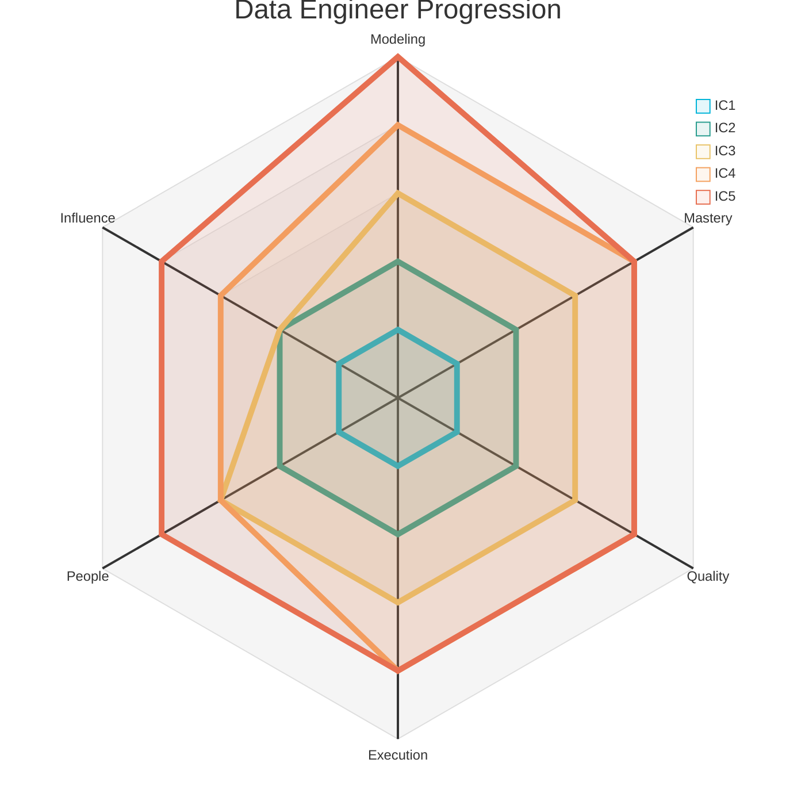
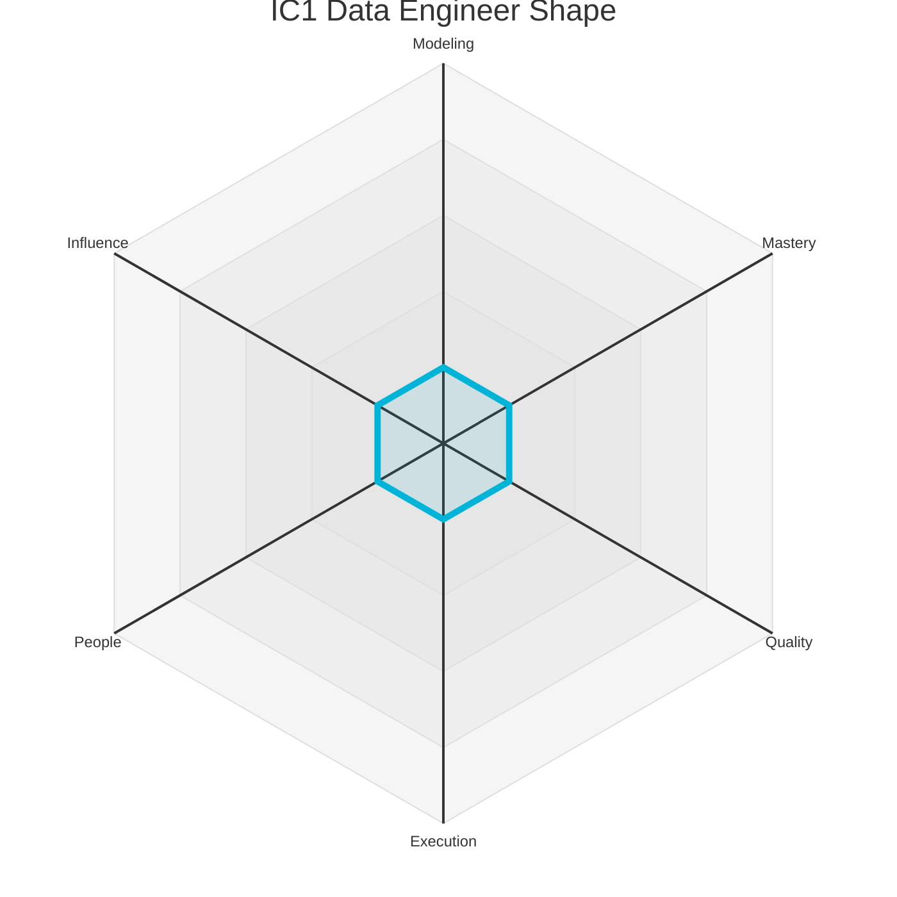
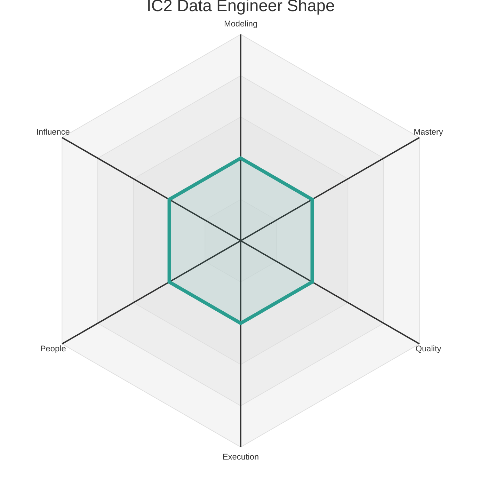
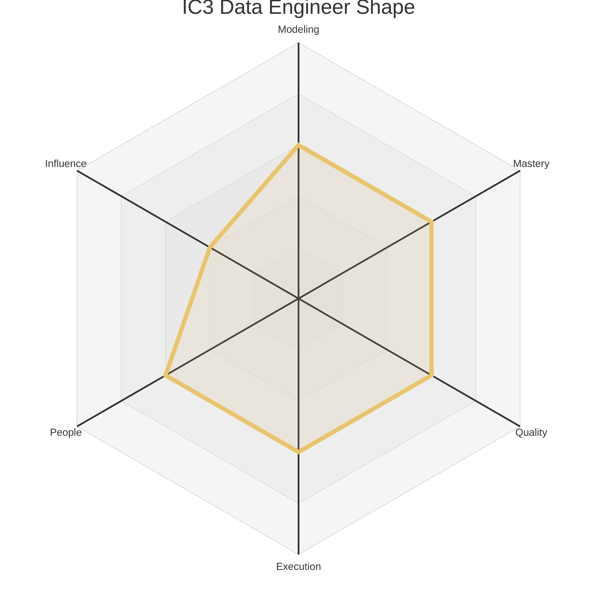
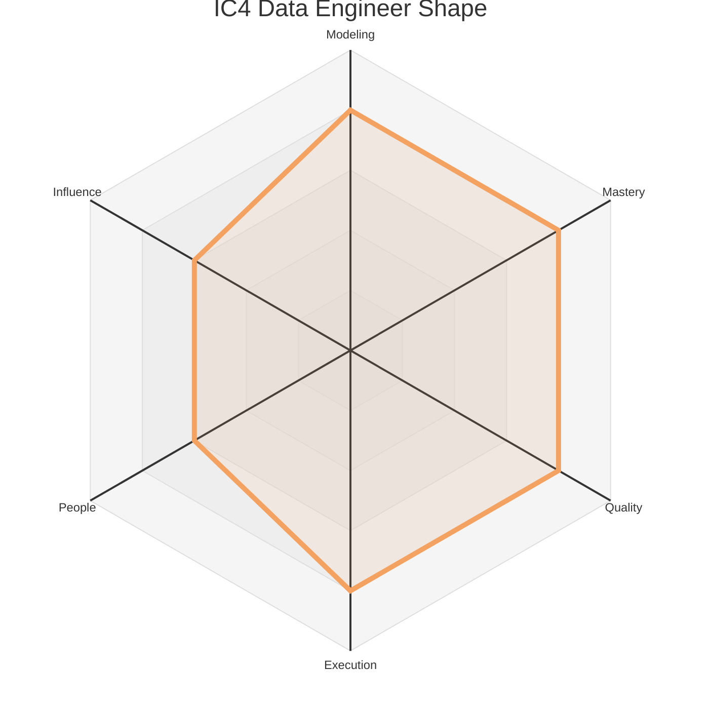
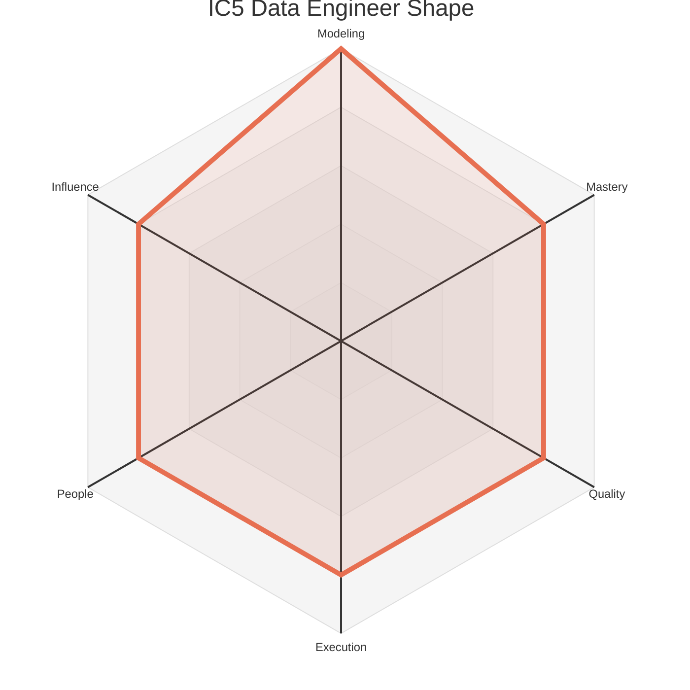

# Data Levels - Data Engineer

This document outlines the five Individual Contributor (IC) levels for a Data Engineer. Each level provides a summary of the expected scope and maps it to the corresponding levels on the six core axes defined in `axes.md`.

The radar chart below visualizes the expected competency shape at each of the five IC levels.

### Level 1: Associate Data Engineer (IC1)

*   **Summary:** A learner who **adopts** team patterns to **implement** straightforward data pipeline tasks within an existing architecture, focusing on developing core data engineering skills.

| Axis     | Level | Description                                                                                                                                                                                                                                                         |
| :------- | :---- | :------------------------------------------------------------------------------------------------------------------------------------------------------------------------------------------------------------------------------------------------------------------ |
| Modeling | 1     | **Data Engineer:** Implements straightforward data pipeline tasks within an existing architecture. Focuses on learning the team's data engineering patterns and tools.                                                                                                |
| Mastery  | 1     | **Data Engineer:** Learns the fundamentals of a programming language (e.g., Python, Scala), a data processing framework (e.g., Spark), and a workflow orchestrator (e.g., Airflow).                                                                                    |
| Quality  | 1     | **Data Engineer:** Writes code that is functional and correct. Relies on code reviews to identify issues.                                                                                                                                                            |
| Execution| 1     | **Data Engineer:** Completes assigned coding tasks and reports status clearly.                                                                                                                                                                                         |
| People   | 1     | Communicates clearly with teammates and remains open to feedback, seeking help when stuck. They build trust by being reliable, listening actively in team discussions, and responding to feedback with a constructive, growth-oriented mindset.                      |
| Influence| 1     | Work primarily impacts their immediate tasks and the features they are assigned to. Their sphere of influence is their own work, and success is defined by learning how their individual contributions fit into the team's larger goals.                             |

### Level 2: Data Engineer (IC2)

*   **Summary:** A reliable contributor who **builds and maintains** data pipelines and **masters** the team's core technologies, ensuring the timely and accurate delivery of data.

| Axis     | Level | Description                                                                                                                                                                                                                                                         |
| :------- | :---- | :------------------------------------------------------------------------------------------------------------------------------------------------------------------------------------------------------------------------------------------------------------------ |
| Modeling | 2     | **Data Engineer:** Builds and maintains reliable data pipelines for a single domain. Can debug and optimize moderately complex data flows.                                                                                                                            |
| Mastery  | 2     | **Data Engineer:** Is proficient in building and debugging data pipelines. Can write clean, efficient, and maintainable code.                                                                                                                                          |
| Quality  | 2     | **Data Engineer:** Writes code that is maintainable, well-tested, and documented.                                                                                                                                                                                     |
| Execution| 2     | **Data Engineer:** Can independently build and ship a new data pipeline.                                                                                                                                                                                             |
| People   | 2     | Actively participates in team rituals. Provides respectful, constructive feedback that helps teammates improve. Is a good collaborator and informally shares knowledge, making the team more effective.                                                               |
| Influence| 2     | Contributions improve the team's ability to achieve its goals. They own analyses, pipelines, or models that their teammates depend on, and their work directly enables the team to be more effective.                                                                  |

### Level 3: Senior Data Engineer (IC3)

*   **Summary:** A data systems owner who **specializes** in a complex domain, **designs** scalable and maintainable data systems, and **supports** the growth of their teammates.

| Axis     | Level | Description                                                                                                                                                                                                                                                         |
| :------- | :---- | :------------------------------------------------------------------------------------------------------------------------------------------------------------------------------------------------------------------------------------------------------------------ |
| Modeling | 3     | **Data Engineer:** Owns a significant component of the data platform (e.g., the data warehouse, a streaming data system). Designs scalable and maintainable data systems.                                                                                              |
| Mastery  | 3     | **Data Engineer:** Is an expert in a specific domain of data engineering (e.g., streaming data, data warehousing).                                                                                                                                                     |
| Quality  | 3     | **Data Engineer:** Champions a culture of data quality and engineering excellence on their team.                                                                                                                                                                     |
| Execution| 3     | **Data Engineer:** Owns a significant part of the data platform.                                                                                                                                                                                                     |
| People   | 3     | Formally coaches teammates and other peers through thoughtful feedback, and knowledge-sharing sessions. Helps resolve team conflicts constructively, improves collaboration practices, and takes an active role in onboarding and supporting the growth of junior team members. |
| Influence| 2     | Contributions improve the team's ability to achieve its goals. They own analyses, pipelines, or models that their teammates depend on, and their work directly enables the team to be more effective.                                                                  |

### Level 4: Staff Data Engineer (IC4)

*   **Summary:** A data platform leader who **designs** and **builds** major new components of the data platform, **evangelizes** best practices, and **orchestrates** large, cross-team data projects.

| Axis     | Level | Description                                                                                                                                                                                                                                                         |
| :------- | :---- | :------------------------------------------------------------------------------------------------------------------------------------------------------------------------------------------------------------------------------------------------------------------ |
| Modeling | 4     | **Data Engineer:** Designs and builds major new components of the data platform that are used by multiple teams.                                                                                                                                                      |
| Mastery  | 4     | **Data Engineer:** Improves data engineering practices across the organization by building reusable tools and frameworks.                                                                                                                                              |
| Quality  | 4     | **Data Engineer:** Designs and implements systems that improve the quality and reliability of the entire data platform.                                                                                                                                                |
| Execution| 4     | **Data Engineer:** Manages a large, cross-team data engineering project.                                                                                                                                                                                             |
| People   | 3     | Formally coaches teammates and other peers through thoughtful feedback, and knowledge-sharing sessions. Helps resolve team conflicts constructively, improves collaboration practices, and takes an active role in onboarding and supporting the growth of junior team members. |
| Influence| 3     | Work shapes the direction of a product area or a business unit. They provide guidance outside their immediate scope and own data products that create leverage for other teams, establishing best practices that are adopted more broadly.                               |

### Level 5: Principal Data Engineer (IC5)

*   **Summary:** A strategic leader who **defines** the long-term vision and architecture for the company's data platform, **innovates** on data engineering practices, and **scales** their impact across the organization.

| Axis     | Level | Description                                                                                                                                                                                                                                                         |
| :------- | :---- | :------------------------------------------------------------------------------------------------------------------------------------------------------------------------------------------------------------------------------------------------------------------ |
| Modeling | 5     | **Data Engineer:** Defines the long-term vision and architecture for the company's data platform.                                                                                                                                                                    |
| Mastery  | 4     | **Data Engineer:** Improves data engineering practices across the organization by building reusable tools and frameworks.                                                                                                                                              |
| Quality  | 4     | **Data Engineer:** Designs and implements systems that improve the quality and reliability of the entire data platform.                                                                                                                                                |
| Execution| 4     | **Data Engineer:** Manages a large, cross-team data engineering project.                                                                                                                                                                                             |
| People   | 4     | Leads project teams by setting clear direction and managing contributors to achieve shared goals. They build consensus across groups, mediate disagreements, and actively support the growth of other mentors, fostering an inclusive environment and acting as a trusted voice in cross-functional forums. |
| Influence| 4     | Defines strategies, standards, or platforms that have a significant, positive impact on the entire organization. Their decisions and leadership on cross-cutting initiatives shape the direction of a large group of data professionals and deliver substantial business value. | 