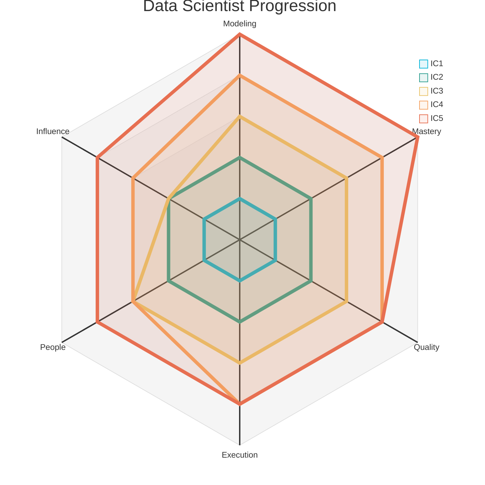
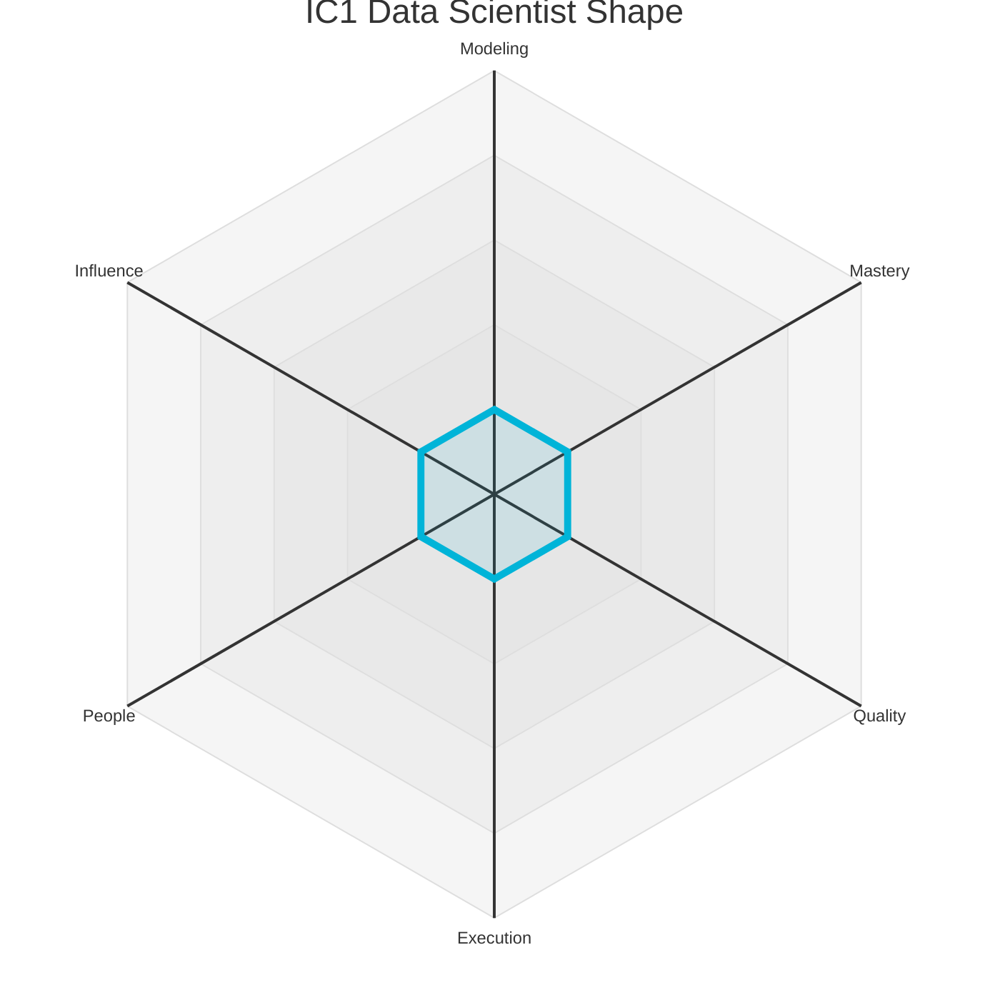
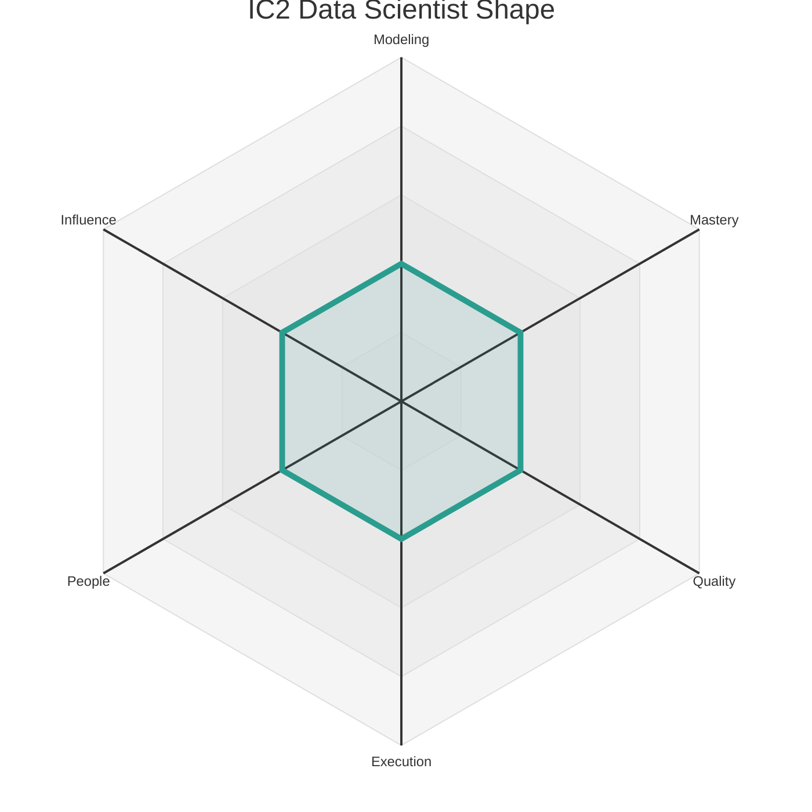
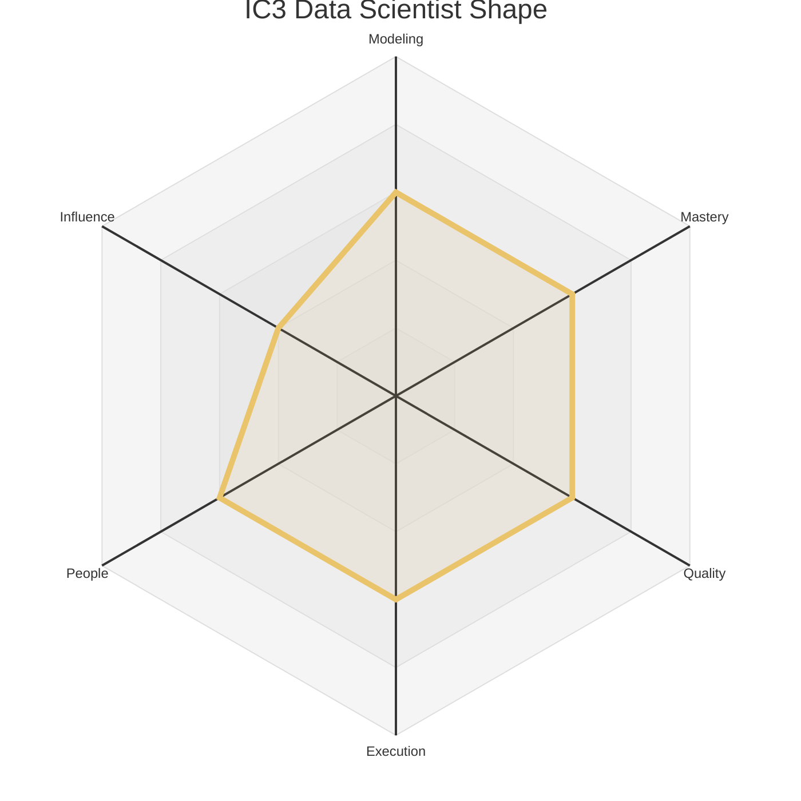
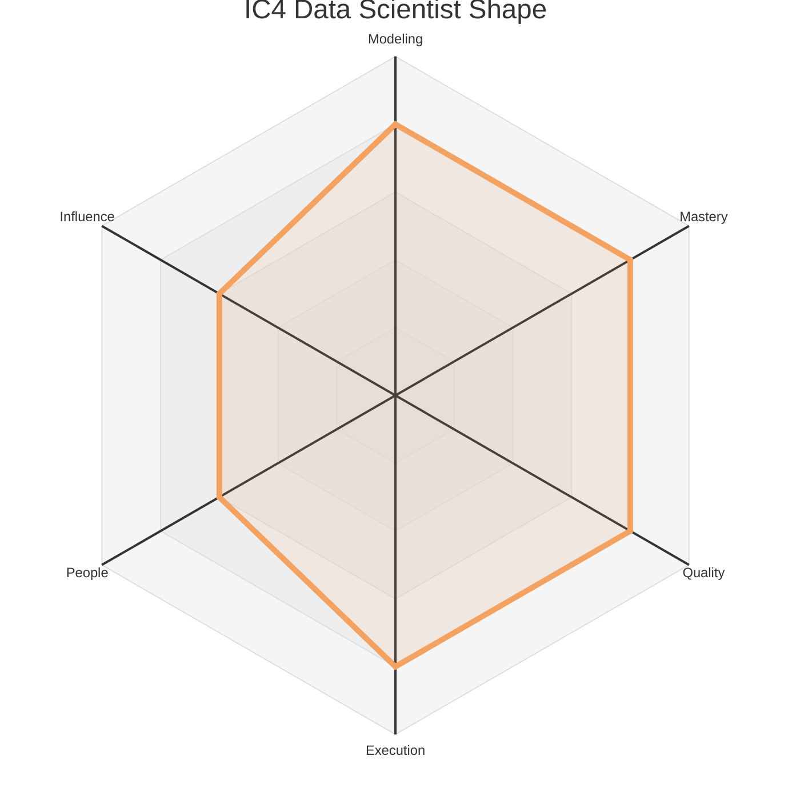
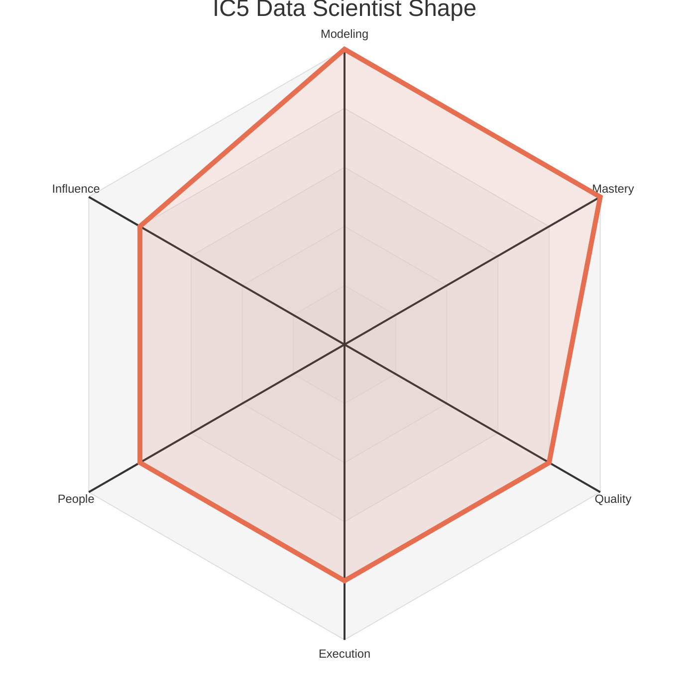

# Data Levels - Data Scientist

This document outlines the five Individual Contributor (IC) levels for a Data Scientist. Each level provides a summary of the expected scope and maps it to the corresponding levels on the six core axes defined in `axes.md`.

The radar chart below visualizes the expected competency shape at each of the five IC levels.

### Level 1: Associate Data Scientist (IC1)

*   **Summary:** A learner who **adopts** team practices to **implement** feature engineering and model training tasks under guidance, focusing on developing core machine learning skills.

| Axis     | Level | Description                                                                                                                                                                                                                                                         |
| :------- | :---- | :------------------------------------------------------------------------------------------------------------------------------------------------------------------------------------------------------------------------------------------------------------------ |
| Modeling | 1     | **Data Scientist:** Implements feature engineering and model training tasks with guidance. Focuses on learning the team's machine learning frameworks and model lifecycle.                                                                                             |
| Mastery  | 1     | **Data Scientist:** Learns the fundamentals of machine learning theory, a programming language (e.g., Python), and common ML libraries (e.g., scikit-learn, TensorFlow).                                                                                                |
| Quality  | 1     | **Data Scientist:** Produces models that are correct and well-documented. Relies on feedback to improve their modeling process.                                                                                                                                       |
| Execution| 1     | **Data Scientist:** Completes assigned modeling tasks and reports status clearly.                                                                                                                                                                                      |
| People   | 1     | Communicates clearly with teammates and remains open to feedback, seeking help when stuck. They build trust by being reliable, listening actively in team discussions, and responding to feedback with a constructive, growth-oriented mindset.                      |
| Influence| 1     | Work primarily impacts their immediate tasks and the features they are assigned to. Their sphere of influence is their own work, and success is defined by learning how their individual contributions fit into the team's larger goals.                             |

### Level 2: Data Scientist (IC2)

*   **Summary:** A reliable contributor who can **independently build and validate** models for well-scoped problems, **mastering** the core machine learning lifecycle.

| Axis     | Level | Description                                                                                                                                                                                                                                                         |
| :------- | :---- | :------------------------------------------------------------------------------------------------------------------------------------------------------------------------------------------------------------------------------------------------------------------ |
| Modeling | 2     | **Data Scientist:** Can independently build and validate a model for a well-scoped problem. Understands the trade-offs between different modeling approaches.                                                                                                       |
| Mastery  | 2     | **Data Scientist:** Is proficient in building and evaluating machine learning models. Can write clean and efficient code for data processing, feature engineering, and modeling.                                                                                       |
| Quality  | 2     | **Data Scientist:** Consistently delivers high-quality models that are well-tested and reproducible.                                                                                                                                                                 |
| Execution| 2     | **Data Scientist:** Can independently build and ship a new machine learning model.                                                                                                                                                                                   |
| People   | 2     | Actively participates in team rituals. Provides respectful, constructive feedback that helps teammates improve. Is a good collaborator and informally shares knowledge, making the team more effective.                                                               |
| Influence| 2     | Contributions improve the team's ability to achieve its goals. They own analyses, pipelines, or models that their teammates depend on, and their work directly enables the team to be more effective.                                                                  |

### Level 3: Senior Data Scientist (IC3)

*   **Summary:** A machine learning model owner who **specializes** in a complex domain, **owns** the end-to-end model lifecycle, and **supports** the growth of their teammates.

| Axis     | Level | Description                                                                                                                                                                                                                                                         |
| :------- | :---- | :------------------------------------------------------------------------------------------------------------------------------------------------------------------------------------------------------------------------------------------------------------------ |
| Modeling | 3     | **Data Scientist:** Owns the end-to-end development and deployment of a machine learning model that solves a business problem. Makes sound decisions about model architecture and evaluation.                                                                            |
| Mastery  | 3     | **Data Scientist:** Is an expert in a specific domain of machine learning (e.g., NLP, computer vision, recommender systems).                                                                                                                                            |
| Quality  | 3     | **Data Scientist:** Champions a culture of modeling excellence and scientific rigor on their team.                                                                                                                                                                   |
| Execution| 3     | **Data Scientist:** Owns a machine learning model that is a key part of the product.                                                                                                                                                                                 |
| People   | 3     | Formally coaches teammates and other peers through thoughtful feedback, and knowledge-sharing sessions. Helps resolve team conflicts constructively, improves collaboration practices, and takes an active role in onboarding and supporting the growth of junior team members. |
| Influence| 2     | Contributions improve the team's ability to achieve its goals. They own analyses, pipelines, or models that their teammates depend on, and their work directly enables the team to be more effective.                                                                  |

### Level 4: Staff Data Scientist (IC4)

*   **Summary:** A machine learning systems leader who **designs** and **builds** ML systems that are core to the company's strategy, **evangelizes** best practices, and **orchestrates** major ML projects.

| Axis     | Level | Description                                                                                                                                                                                                                                                         |
| :------- | :---- | :------------------------------------------------------------------------------------------------------------------------------------------------------------------------------------------------------------------------------------------------------------------ |
| Modeling | 4     | **Data Scientist:** Designs and builds machine learning systems that are a core part of the company's product or strategy. Their work often involves solving novel and ambiguous problems.                                                                               |
| Mastery  | 4     | **Data Scientist:** Improves machine learning practices across the organization by building reusable tools and frameworks.                                                                                                                                             |
| Quality  | 4     | **Data Scientist:** Designs and implements frameworks and platforms that improve the quality and reliability of machine learning across the organization.                                                                                                              |
| Execution| 4     | **Data Scientist:** Manages a large, cross-team machine learning project.                                                                                                                                                                                            |
| People   | 3     | Formally coaches teammates and other peers through thoughtful feedback, and knowledge-sharing sessions. Helps resolve team conflicts constructively, improves collaboration practices, and takes an active role in onboarding and supporting the growth of junior team members. |
| Influence| 3     | Work shapes the direction of a product area or a business unit. They provide guidance outside their immediate scope and own data products that create leverage for other teams, establishing best practices that are adopted more broadly.                               |

### Level 5: Principal Data Scientist (IC5)

*   **Summary:** A strategic leader who **defines** the company's strategy for machine learning, **innovates** on modeling techniques, and **scales** their impact across the organization.

| Axis     | Level | Description                                                                                                                                                                                                                                                         |
| :------- | :---- | :------------------------------------------------------------------------------------------------------------------------------------------------------------------------------------------------------------------------------------------------------------------ |
| Modeling | 5     | **Data Scientist:** Defines the company's strategy for machine learning and artificial intelligence. Their work creates new business opportunities for the company.                                                                                                      |
| Mastery  | 5     | **Data Scientist:** Is an industry leader in machine learning. Develops new modeling techniques that advance the state of the art.                                                                                                                                     |
| Quality  | 4     | **Data Scientist:** Designs and implements frameworks and platforms that improve the quality and reliability of machine learning across the organization.                                                                                                              |
| Execution| 4     | **Data Scientist:** Manages a large, cross-team machine learning project.                                                                                                                                                                                            |
| People   | 4     | Leads project teams by setting clear direction and managing contributors to achieve shared goals. They build consensus across groups, mediate disagreements, and actively support the growth of other mentors, fostering an inclusive environment and acting as a trusted voice in cross-functional forums. |
| Influence| 4     | Defines strategies, standards, or platforms that have a significant, positive impact on the entire organization. Their decisions and leadership on cross-cutting initiatives shape the direction of a large group of data professionals and deliver substantial business value. | 