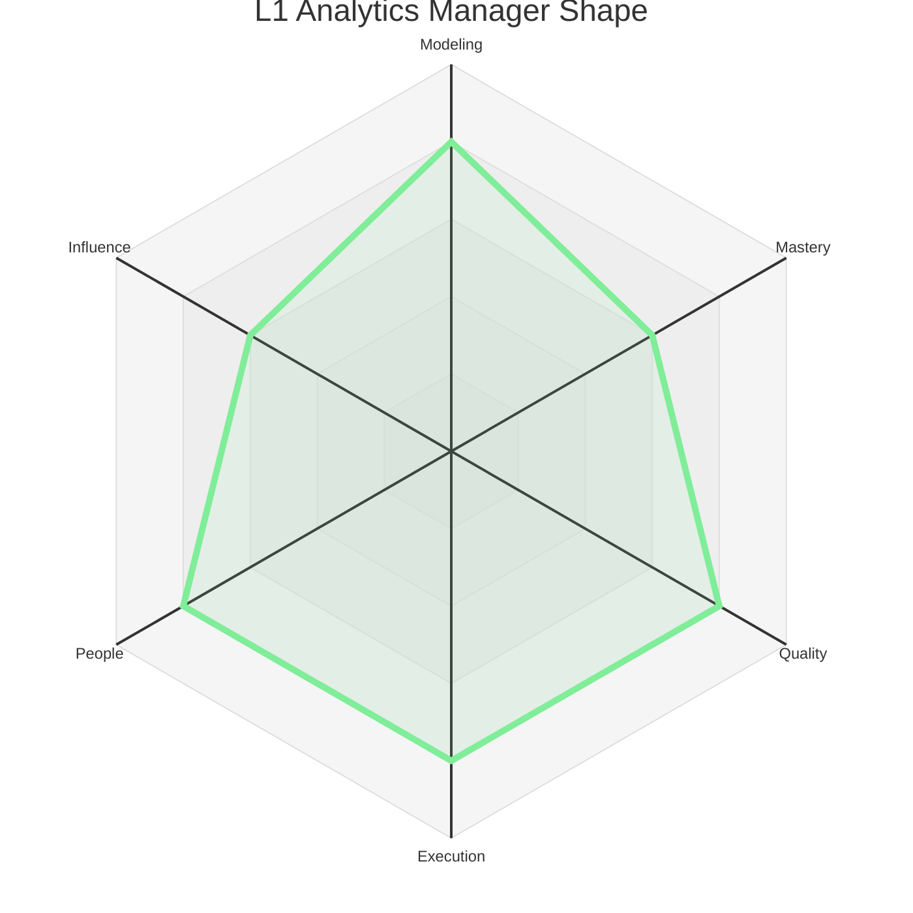
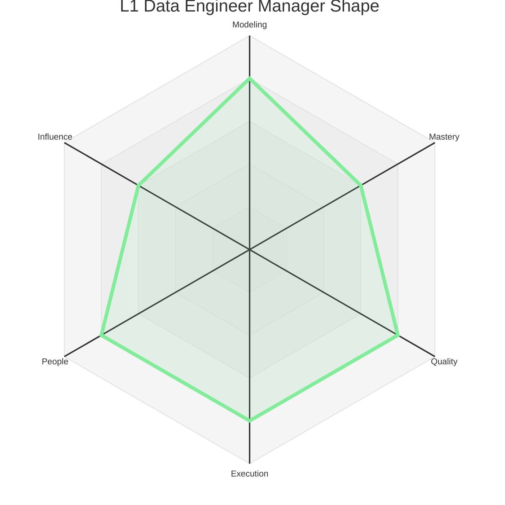
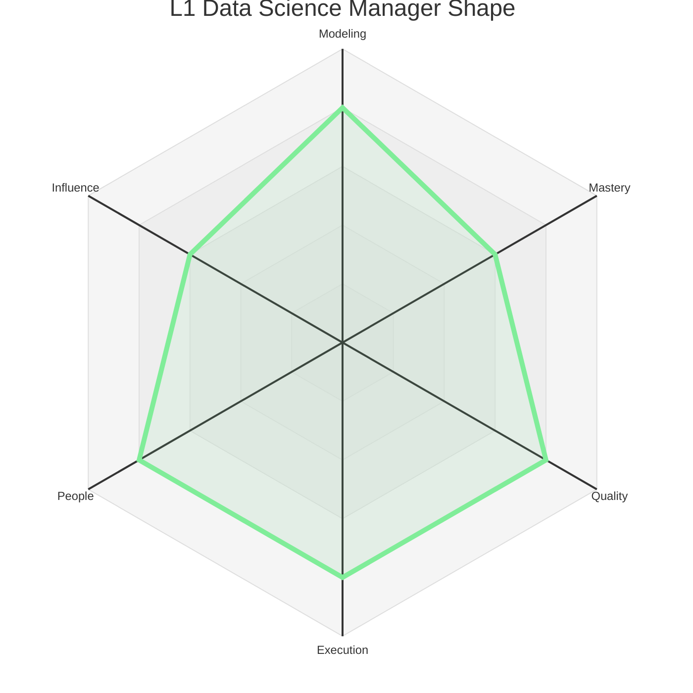
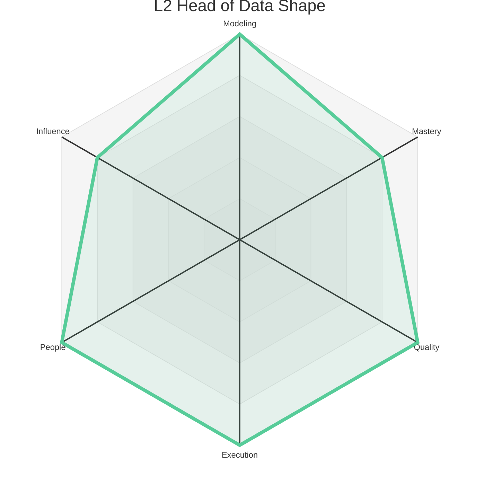
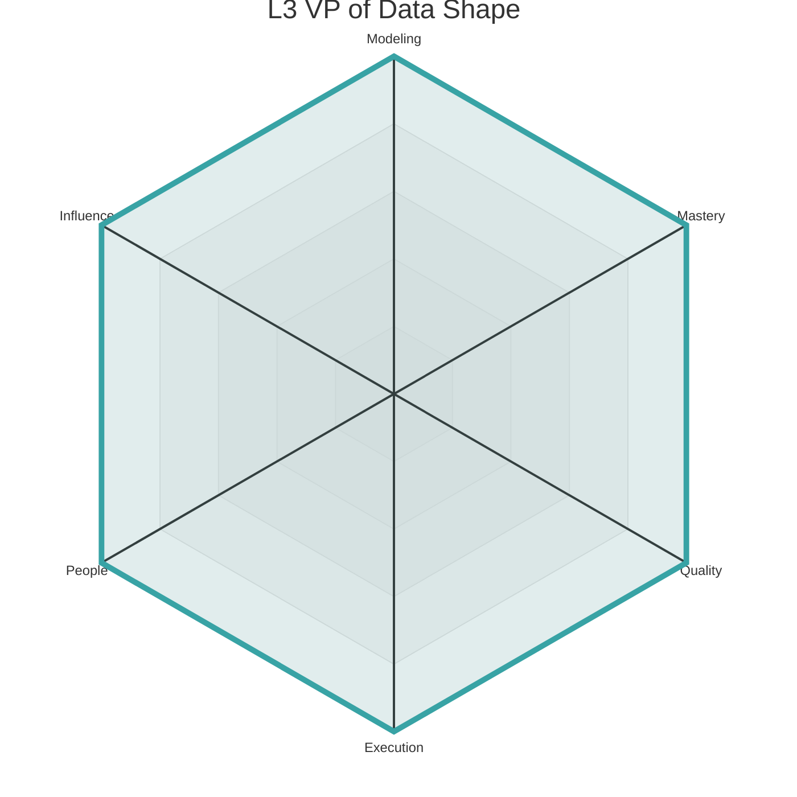

# Data Levels - Manager

This document outlines the Manager levels for the Data discipline. It is divided into two distinct tracks: **Discipline Management** (for specific data functions) and **Data Leadership** (for broader organizational scope).

---

## Discipline Management Track

This track is for leaders who manage a team within a specific data discipline.

### Level 1: Data Analytics Manager (L1)

*   **Summary:** A Data Analytics Manager **leads** a team of analysts, focusing on their growth, execution, and the quality of insights delivered to the business.

| Axis     | Level | Description (Manager Context)                                                                                                                                                                                                                                                                                                                                                          |
| :------- | :---- | :------------------------------------------------------------------------------------------------------------------------------------------------------------------------------------------------------------------------------------------------------------------------------------------------------------------------------------------------------------------------------------- |
| Modeling | 4     | **(Team's Analytics Strategy):** Designs and implements a cohesive analytics strategy for a large part of the business, guiding the team to answer the most important questions and influencing the direction of multiple teams.                                                                                                                                                             |
| Mastery  | 3     | **(Management Skills):** Is proficient in core management practices, including running effective 1:1s, giving constructive feedback, setting clear goals, and managing performance. They are developing their skills in coaching, situational leadership, and team building.                                                                                                            |
| Quality  | 4     | **(Team's Quality Culture):** Fosters a culture of data quality and analytical rigor. They ensure the team has effective processes for validating data and analyses, and they are accountable for the accuracy and reliability of the insights their team produces.                                                                                                                        |
| Execution| 4     | **(Team Delivery):** Ensures the team executes and delivers on its commitments reliably. They are skilled at project management, removing blockers, managing stakeholder expectations, and communicating progress and risks.                                                                                                                                                             |
| People   | 4     | **(People Growth):** Is dedicated to the growth and development of their analysts. They are an effective coach and mentor, helping their reports achieve their career goals. They are responsible for hiring and building a diverse, inclusive, and high-performing team.                                                                                                                 |
| Influence| 3     | **(Team & Peers):** Effectively represents the team to its direct stakeholders (e.g., product managers, other engineering teams). They build strong relationships with their peers and are a trusted partner in cross-functional collaborations.                                                                                                                                            |

### Level 1: Data Engineer Manager (L1)

*   **Summary:** A Data Engineer Manager **leads** a team of data engineers, focusing on their growth, execution, and the reliability and scalability of the data platform.

| Axis     | Level | Description (Manager Context)                                                                                                                                                                                                                                                                                                                                                          |
| :------- | :---- | :------------------------------------------------------------------------------------------------------------------------------------------------------------------------------------------------------------------------------------------------------------------------------------------------------------------------------------------------------------------------------------- |
| Modeling | 4     | **(Team's System Strategy):** Is responsible for the technical strategy and health of their team's component of the data platform. They work with senior ICs to ensure the team's roadmap aligns with the broader data platform vision.                                                                                                                                                    |
| Mastery  | 3     | **(Management Skills):** Is proficient in core management practices, including running effective 1:1s, giving constructive feedback, setting clear goals, and managing performance. They are developing their skills in coaching, situational leadership, and team building.                                                                                                            |
| Quality  | 4     | **(Team's Quality Culture):** Fosters a culture of data quality and engineering excellence. They ensure the team has effective processes for testing, code review, and safe deployment. They are accountable for the reliability and quality of their team's data systems.                                                                                                                |
| Execution| 4     | **(Team Delivery):** Ensures the team executes and delivers on its commitments reliably. They are skilled at project management, removing blockers, managing dependencies, and communicating progress and risks.                                                                                                                                                                         |
| People   | 4     | **(People Growth):** Is dedicated to the growth and development of their engineers. They are an effective coach and mentor, helping their reports achieve their career goals. They are responsible for hiring and building a diverse, inclusive, and high-performing team.                                                                                                                |
| Influence| 3     | **(Team & Peers):** Effectively represents the team to its direct stakeholders. They build strong relationships with their peers and are a trusted partner in ensuring the data platform meets the needs of the business.                                                                                                                                                               |

### Level 1: Data Science Manager (L1)

*   **Summary:** A Data Science Manager **leads** a team of data scientists, focusing on their growth, execution, and the business impact of the models they build.

| Axis     | Level | Description (Manager Context)                                                                                                                                                                                                                                                                                                                                                          |
| :------- | :---- | :------------------------------------------------------------------------------------------------------------------------------------------------------------------------------------------------------------------------------------------------------------------------------------------------------------------------------------------------------------------------------------- |
| Modeling | 4     | **(Team's ML Strategy):** Is responsible for the ML strategy for their team's domain. They work with senior ICs and product managers to identify high-impact opportunities for machine learning and ensure the team is working on the right problems.                                                                                                                                      |
| Mastery  | 3     | **(Management Skills):** Is proficient in core management practices, including running effective 1:1s, giving constructive feedback, setting clear goals, and managing performance. They are developing their skills in coaching, situational leadership, and team building.                                                                                                            |
| Quality  | 4     | **(Team's Quality Culture):** Fosters a culture of modeling excellence and scientific rigor. They ensure the team has effective processes for model validation, testing, and deployment. They are accountable for the quality and business impact of their team's models.                                                                                                                    |
| Execution| 4     | **(Team Delivery):** Ensures the team executes and delivers on its commitments reliably. They are skilled at managing the lifecycle of a machine learning project, from research and development to production deployment and monitoring.                                                                                                                                                  |
| People   | 4     | **(People Growth):** Is dedicated to the growth and development of their data scientists. They are an effective coach and mentor, helping their reports achieve their career goals. They are responsible for hiring and building a diverse, inclusive, and high-performing team.                                                                                                          |
| Influence| 3     | **(Team & Peers):** Effectively represents the team to its direct stakeholders. They build strong relationships with their peers and are a trusted partner in ensuring the business is getting the most value from machine learning.                                                                                                                                                       |

---
---

## Data Leadership Track

This track is for leaders who manage multiple data teams and are responsible for the overall data strategy and organization.

### Level 2: Head of Data (L2)

*   **Summary:** A Head of Data **manages** multiple data teams and their managers. They **evolve** the broader data strategy and **adjust** organizational processes to scale the impact of their entire group.

| Axis     | Level | Description (Manager Context)                                                                                                                                                                                                                                                                                                                                                           |
| :------- | :---- | :-------------------------------------------------------------------------------------------------------------------------------------------------------------------------------------------------------------------------------------------------------------------------------------------------------------------------------------------------------------------------------------- |
| Modeling | 5     | **(Group's Data Strategy):** Defines the data strategy for a major business unit or the entire company. They identify new opportunities to use data to create business value and work with other leaders to ensure the data organization is aligned with the company's goals.                                                                                                             |
| Mastery  | 4     | **(Organizational Leadership):** Has mastered the skills of managing a single team and is now learning to lead an organization. This includes managing other managers, organizational design, budget planning, and developing a leadership pipeline. They are a skilled organizational leader.                                                                                        |
| Quality  | 5     | **(Group's Quality Culture):** Is responsible for the data quality and rigor of an entire group of teams. They identify and address systemic issues and sponsor initiatives that improve data quality and governance across their organization.                                                                                                                                          |
| Execution| 5     | **(Group Delivery & Process):** Is accountable for the execution of an entire data group. They ensure that their organization has the right processes and tools to deliver on complex, cross-functional projects. They are skilled at managing a portfolio of data projects and making strategic trade-offs to maximize impact.                                                              |
| People   | 5     | **(Developing Leaders):** Is a "manager of managers." They are skilled at hiring, developing, and leading other managers. They are a steward of the data culture and are responsible for creating a healthy, inclusive, and high-performing environment for their entire group.                                                                                                          |
| Influence| 4     | **(Department & Leadership):** Has influence across a significant portion of the company. They are a key member of the leadership team and contribute to defining the overall strategy and direction for the company. They are a trusted partner to senior cross-functional leaders.                                                                                                     |

### Level 3: VP of Data (L3)

*   **Summary:** A VP of Data **leads** the entire data organization. They **create** the data vision and organizational structure that enables the company to achieve its long-term goals.

| Axis     | Level | Description (Manager Context)                                                                                                                                                                                                                                                                                                                                                          |
| :------- | :---- | :------------------------------------------------------------------------------------------------------------------------------------------------------------------------------------------------------------------------------------------------------------------------------------------------------------------------------------------------------------------------------------- |
| Modeling | 5     | **(Organizational & Data Vision):** Is responsible for the long-term data vision and strategy for the entire company. They ensure that the company is making the right long-term investments in data and that the data strategy can support the future needs of the business. They are a key partner to the CEO and other executives.                                                    |
| Mastery  | 5     | **(Executive Leadership):** Is an experienced data executive. They have mastered the skills of leading a large data organization and are a key member of the company's executive team. They are skilled at communicating a compelling vision, driving organizational change, and representing the company's data strategy to the board and external stakeholders.                        |
| Quality  | 5     | **(Organizational Culture of Excellence):** Is the ultimate owner of the company's data quality and governance. They foster a culture of data excellence and ensure that the organization is continuously improving its ability to use data to make better decisions.                                                                                                                      |
| Execution| 5     | **(Organizational Effectiveness):** Is responsible for the overall execution and effectiveness of the data organization. They ensure that the organization is structured and resourced to achieve the company's goals and that it is operating efficiently. They are a master of organizational design and data development processes.                                                      |
| People   | 5     | **(Organizational Culture & Talent):** Is the steward of the data culture. They are responsible for creating an environment where talented data professionals and leaders can thrive. They are the ultimate owner of the company's ability to attract, retain, and develop world-class data talent.                                                                                           |
| Influence| 5     | **(Company & Industry):** Has influence across the entire company and often in the broader data industry. They are a key member of the executive team and help to shape the overall strategy of the company. They are a recognized leader in the industry and help to build the company's brand and reputation in the data space.                                                           | 