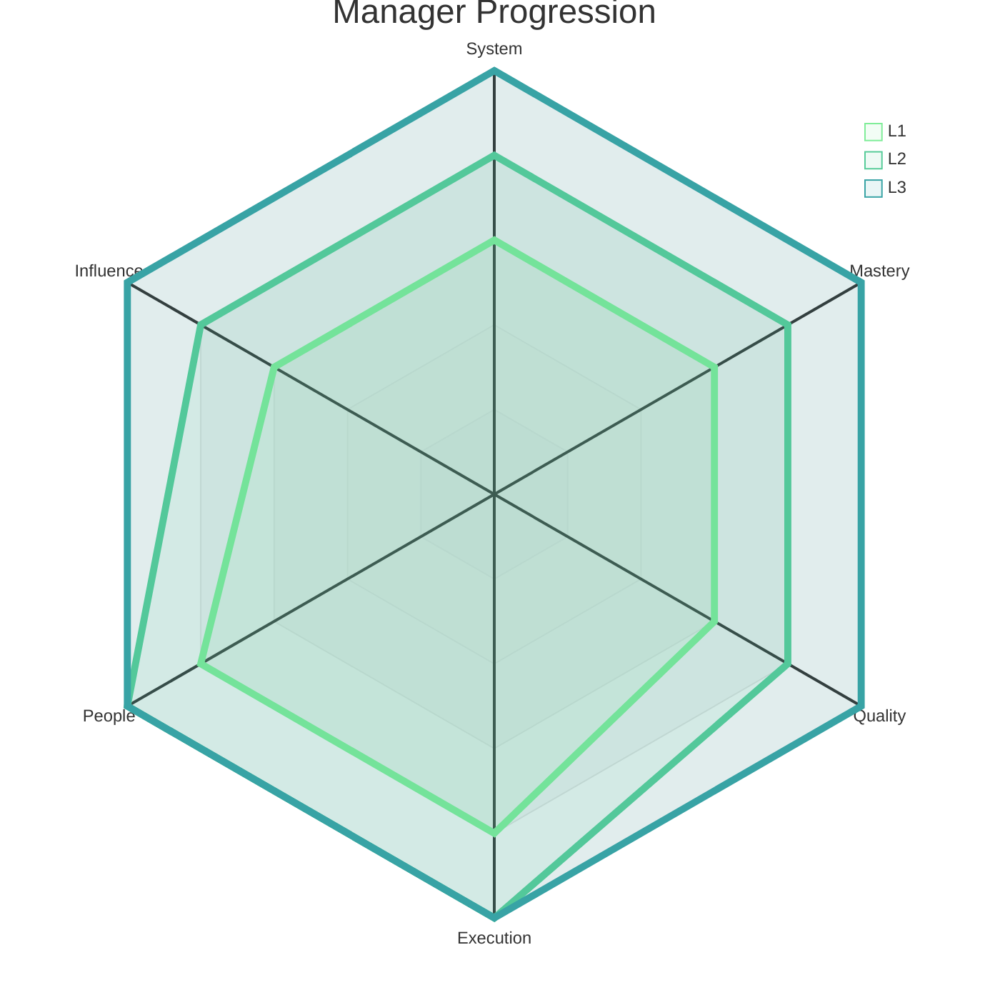
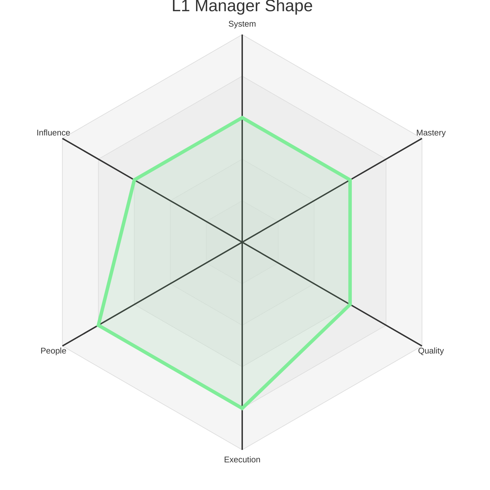
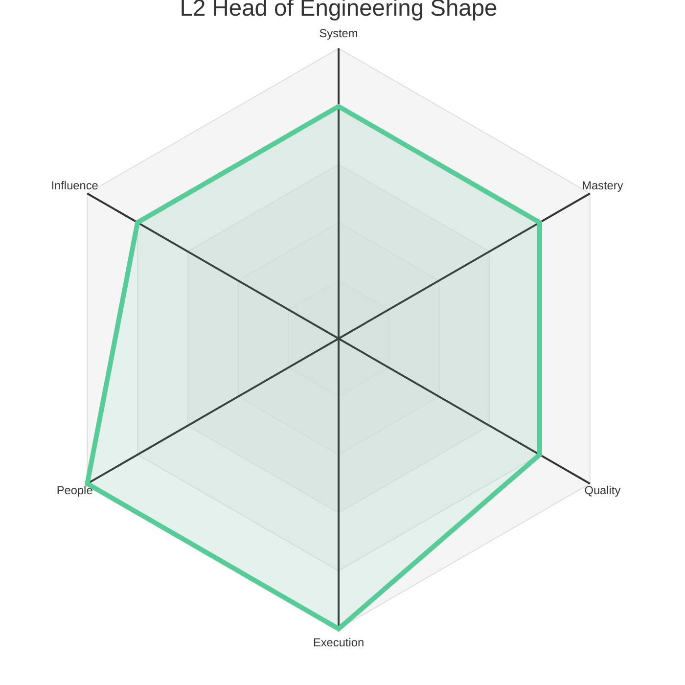
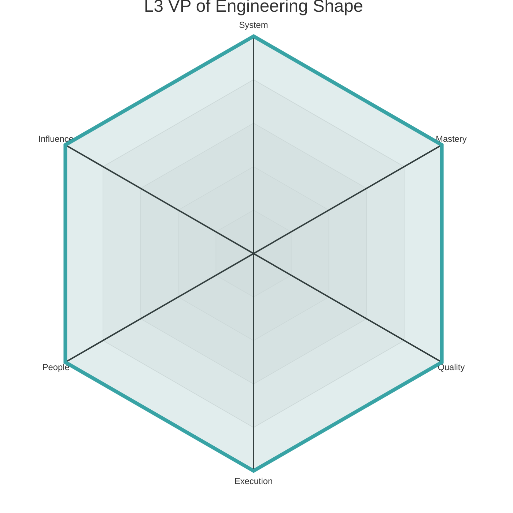

# Engineering Levels - Manager

This document outlines the three Manager levels for the Engineering discipline. Each level provides a summary of the expected scope and maps it to the corresponding levels on the six core axes, adapted for a management context.

The radar chart below visualizes the expected competency shape at each Manager level.

### Level 1: Engineering Manager (L1)

*   **Summary:** An Engineering Manager **leads** a team of engineers, focusing on their growth and the team's execution. They **own** their team's delivery, culture, and operational excellence.

| Axis      | Level | Description (Manager Context)                                                                                                                                                                                                                                                                                                                                                          |
| :-------- | :---- | :------------------------------------------------------------------------------------------------------------------------------------------------------------------------------------------------------------------------------------------------------------------------------------------------------------------------------------------------------------------------------------- |
| System    | 3     | **(Team's Systems & Strategy):** Understands the architecture and vision for the team's systems. Can effectively represent the team's technical strategy and challenges to stakeholders, ensuring alignment with broader product goals. They facilitate design discussions and help the team make sound technical decisions.                                                             |
| Mastery   | 3     | **(Management Skills):** Is proficient in core management practices, including running effective 1:1s, giving constructive feedback, setting clear goals, and managing performance. They are developing their skills in coaching, situational leadership, and team building.                                                                                                            |
| Quality   | 3     | **(Team's Quality Culture):** Fosters a culture of quality within the team. They ensure the team has effective processes for testing, code review, and releasing software safely. They are accountable for the quality of their team's output and use data (e.g., bug rates, incident metrics) to drive improvements.                                                                   |
| Execution | 4     | **(Team Delivery):** Ensures the team executes and delivers on its commitments reliably and predictably. They are skilled at project management, removing blockers, managing dependencies, and communicating progress and risks. They create an environment where the team can do its best work.                                                                                         |
| People    | 4     | **(People Growth):** Is dedicated to the growth and development of their team members. They are an effective coach and mentor, helping engineers identify and achieve their career goals. They are responsible for hiring and building a diverse, inclusive, and high-performing team.                                                                                                |
| Influence | 3     | **(Team & Peers):** Effectively represents the team to its direct stakeholders (e.g., product managers, other engineering teams). They build strong relationships with their peers and are a trusted partner in cross-functional collaborations. Their influence is primarily at the level of their team and its immediate adjacencies.                                                |

### Level 2: Head of Engineering (L2)

*   **Summary:** A Head of Engineering **manages** multiple teams and their managers. They **evolve** the broader technical strategy and **adjust** organizational processes to scale the impact of their entire group.

| Axis      | Level | Description (Manager Context)                                                                                                                                                                                                                                                                                                                                                           |
| :-------- | :---- | :-------------------------------------------------------------------------------------------------------------------------------------------------------------------------------------------------------------------------------------------------------------------------------------------------------------------------------------------------------------------------------------- |
| System    | 4     | **(Multi-System Strategy):** Is responsible for the technical strategy and health of a group of related systems. They work with senior ICs and other managers to define a long-term technical vision for their domain and ensure that it aligns with the company's overall architecture and business goals.                                                                               |
| Mastery   | 4     | **(Organizational Leadership):** Has mastered the skills of managing a single team and is now learning to lead an organization. This includes managing other managers, organizational design, budget planning, and developing a leadership pipeline. They are a skilled organizational leader.                                                                                        |
| Quality   | 4     | **(Group's Quality Culture):** Is responsible for the quality culture and outcomes of an entire group of teams. They identify and address systemic quality issues and sponsor initiatives that improve quality across their organization. They ensure that their teams are building high-quality, sustainable systems.                                                                      |
| Execution | 5     | **(Group Delivery & Process):** Is accountable for the execution of an entire group of teams. They ensure that their organization has the right processes and tools to deliver on complex, cross-functional projects. They are skilled at managing a portfolio of projects and making strategic trade-offs to maximize impact.                                                             |
| People    | 5     | **(Developing Leaders):** Is a "manager of managers." They are skilled at hiring, developing, and leading other managers. They are a steward of the organization's culture and are responsible for creating a healthy, inclusive, and high-performing environment for their entire group.                                                                                              |
| Influence | 4     | **(Department & Leadership):** Has influence across a significant portion of the engineering organization. They are a key member of the engineering leadership team and contribute to defining the overall strategy and direction for engineering. They are a trusted partner to product and other cross-functional leaders.                                                                |

### Level 3: VP of Engineering (L3)

*   **Summary:** A VP of Engineering **leads** the entire engineering organization. They **create** the technical vision and organizational structure that enables the company to achieve its long-term goals.

| Axis      | Level | Description (Manager Context)                                                                                                                                                                                                                                                                                                                                                          |
| :-------- | :---- | :------------------------------------------------------------------------------------------------------------------------------------------------------------------------------------------------------------------------------------------------------------------------------------------------------------------------------------------------------------------------------------- |
| System    | 5     | **(Organizational & Technical Vision):** Is responsible for the long-term technical vision and strategy for the entire company. They ensure that the company is making the right long-term technology investments and that the architecture can support the future needs of the business. They are a key partner to the CEO and other executives.                                         |
| Mastery   | 5     | **(Executive Leadership):** Is an experienced executive leader. They have mastered the skills of leading a large engineering organization and are a key member of the company's executive team. They are skilled at communicating a compelling vision, driving organizational change, and representing the company's technology to the board and external stakeholders.            |
| Quality   | 5     | **(Organizational Culture of Excellence):** Is the ultimate owner of the quality of the company's products and the health of its systems. They foster a culture of engineering excellence and ensure that the organization is continuously improving its ability to deliver high-quality, reliable software at scale.                                                                        |
| Execution | 5     | **(Organizational Effectiveness):** Is responsible for the overall execution and effectiveness of the engineering organization. They ensure that the organization is structured and resourced to achieve the company's goals and that it is operating efficiently and effectively. They are a master of organizational design and process improvement.                             |
| People    | 5     | **(Organizational Culture & Talent):** Is the steward of the engineering culture. They are responsible for creating an environment where talented engineers and leaders can thrive. They are the ultimate owner of the company's ability to attract, retain, and develop world-class engineering talent.                                                                                   |
| Influence | 5     | **(Company & Industry):** Has influence across the entire company and often in the broader tech industry. They are a key member of the executive team and help to shape the overall strategy of the company. They are a recognized leader in the industry and help to build the company's brand and reputation.                                                                            | 