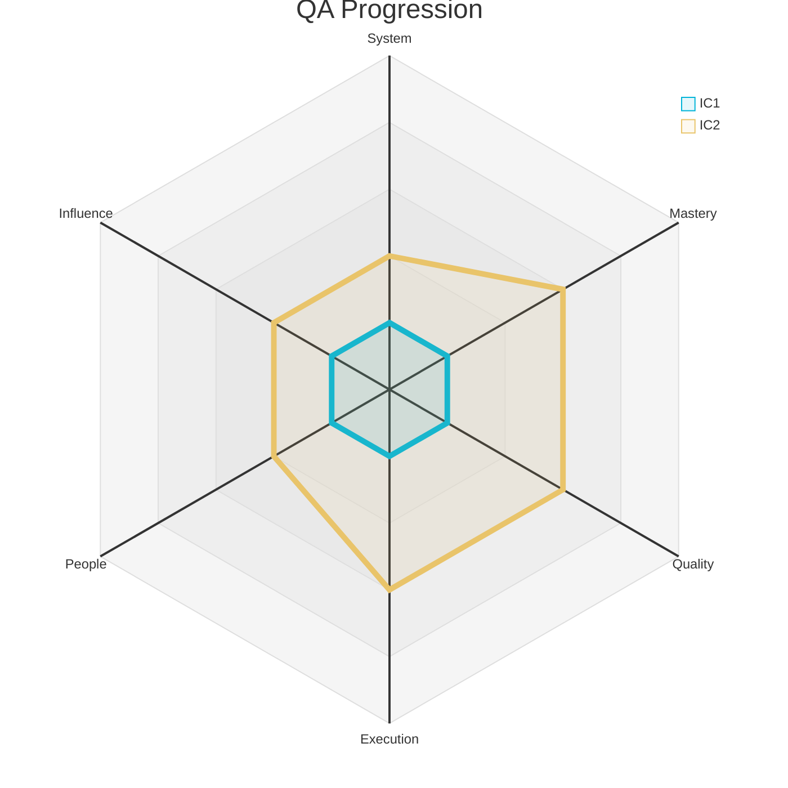
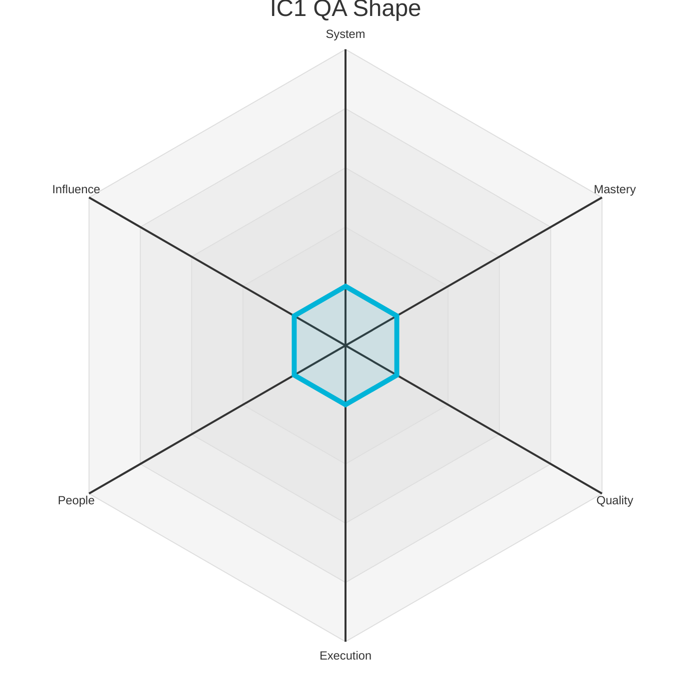
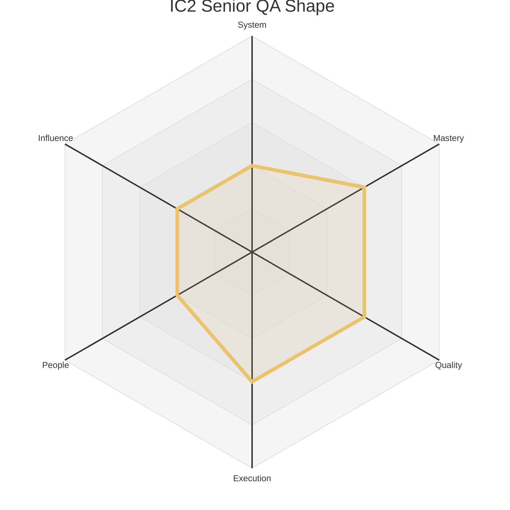

# Engineering Levels - QA Engineer

This document outlines the Individual Contributor (IC) levels for a QA Engineer. Each level provides a summary of the expected scope and maps it to the corresponding levels on the six core axes defined in `axes.md`.

The radar chart below visualizes the expected competency shape at each IC level.

### Level 1: QA Engineer (IC1)

*   **Summary:** A learner who **adopts** team testing practices and **enhances** quality by executing test plans and documenting results. They are focused on growing their skills in quality principles and tools.

| Axis      | Level | Description                                                                                                                                                                                                                                                                                                                                     |
| :-------- | :---- | :------------------------------------------------------------------------------------------------------------------------------------------------------------------------------------------------------------------------------------------------------------------------------------------------------------------------------------------------ |
| System    | 1     | Understands the test scope for a single, isolated feature. They execute pre-written test cases accurately, clearly document the results, and can follow a bug's lifecycle. Their system view is limited to the user-facing functionality they are assigned to test, and they are learning to think about edge cases.                                |
| Mastery   | 1     | Learns the fundamentals of different testing types (e.g., manual, automated, performance) and the specific tools used by the team. Their focus is on developing a strong foundation in quality principles and executing assigned testing tasks with a high degree of accuracy and attention to detail.                                                  |
| Quality   | 1     | Executes test cases accurately and reports defects with clear, reproducible steps, ensuring that issues are well-understood by developers. They rely on feedback to improve their test case design and bug reporting skills. Their work provides a crucial signal about the state of the product.                                                           |
| Execution | 1     | Completes assigned test execution tasks and reports status clearly and on time. They are learning to manage their testing workload and to communicate their progress effectively to the team. They are a reliable contributor to the team's testing efforts.                                                                                         |
| People    | 1     | Communicates clearly with teammates and remains open to feedback, seeking help when stuck. They build trust by being reliable, listening actively in team discussions, and responding to feedback with a constructive, growth-oriented mindset.                                                                                                 |
| Influence | 1     | Work primarily impacts their immediate module or tasks. Their sphere of influence is their own work, and success is defined by learning how their individual contributions fit into the team's larger goals.                                                                                                                                      |

### Level 2: Senior QA Engineer (IC2)

*   **Summary:** A quality owner who **designs** comprehensive test strategies and **implements** robust automation. They are a quality leader on their team, focused on preventing bugs, not just finding them.

| Axis      | Level | Description                                                                                                                                                                                                                                                                                                                              |
| :-------- | :---- | :--------------------------------------------------------------------------------------------------------------------------------------------------------------------------------------------------------------------------------------------------------------------------------------------------------------------------------------- |
| System    | 2     | Designs and writes test cases for small-to-medium features that may interact with other components. They can identify and isolate bugs in familiar areas of the application and understand the data flow between a few connected services. They begin to think about how different parts of the system can fail.                               |
| Mastery   | 3     | Is an expert in a specific area of quality, such as performance testing, security testing, or a complex part of the product. They design and implement sophisticated test strategies to address challenging quality problems, and they coach other engineers on how to improve their testing skills in this area.                                        |
| Quality   | 3     | Champions a culture of quality on their team, moving beyond finding bugs to helping prevent them in the first place. They are involved early in the design process to identify quality risks and use data to help their team make informed decisions about what to test and when to release.                                                                   |
| Execution | 3     | Owns the quality for a large feature or product area. They define the test strategy, coordinate the execution of testing across multiple engineers (both QA and developers), and are accountable for the final quality of the release. They are a key partner to the product manager and tech lead.                                                      |
| People    | 2     | Actively participates in team rituals. Provides respectful, constructive feedback that helps teammates improve. Is a good pairing partner and informally shares knowledge, making the team more effective.                                                                                                                                   |
| Influence | 2     | Contributions improve the team's productivity and the reliability of its services. They own components or processes that teammates depend on, and their work directly enables the team to achieve its goals more effectively.                                                                                                                     | 