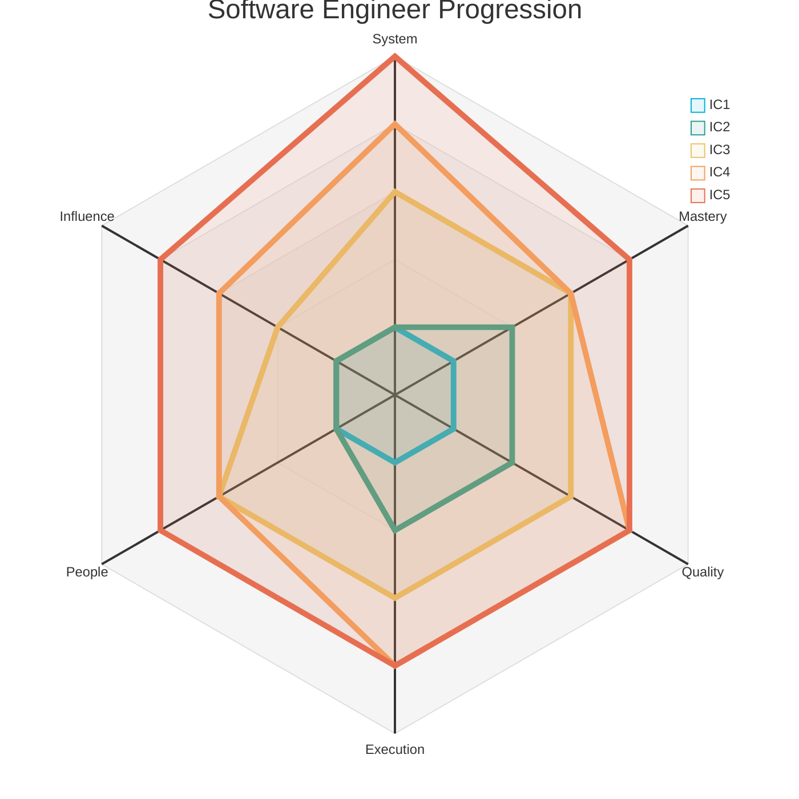
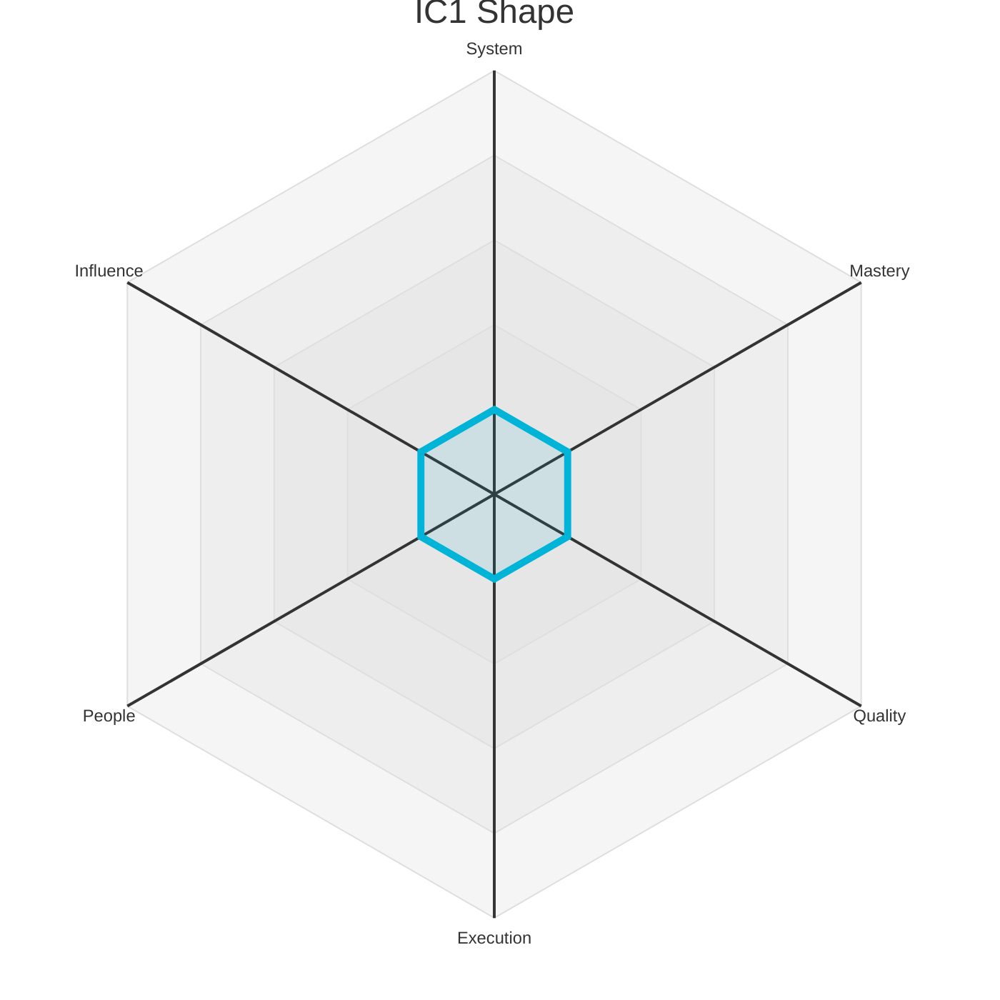
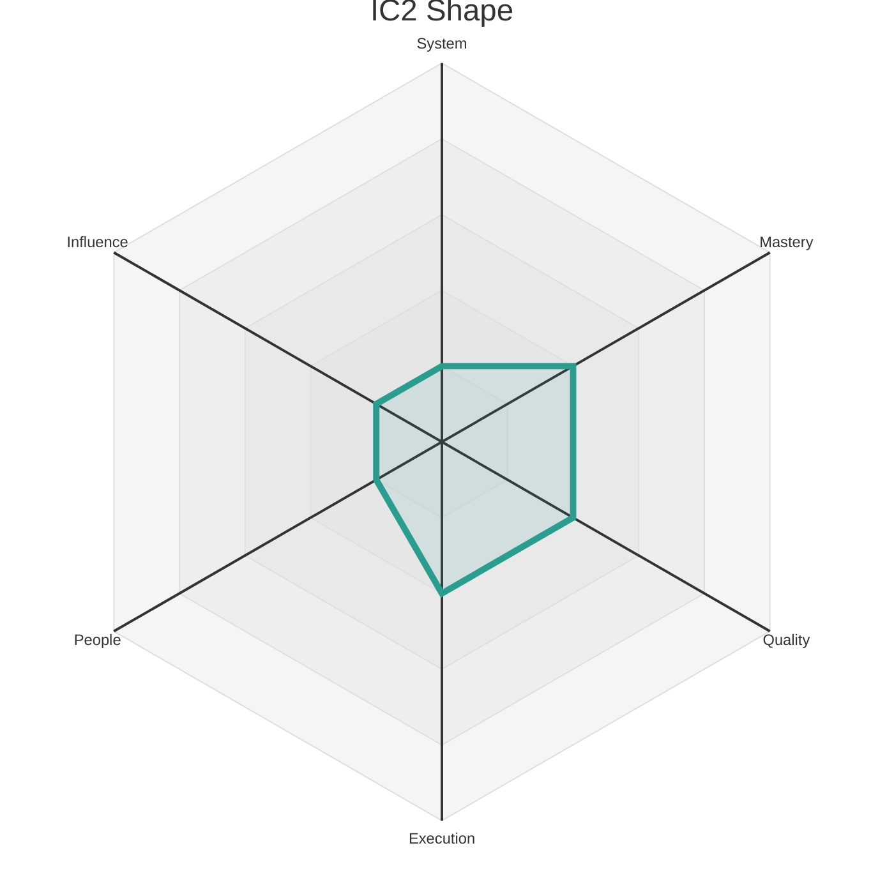
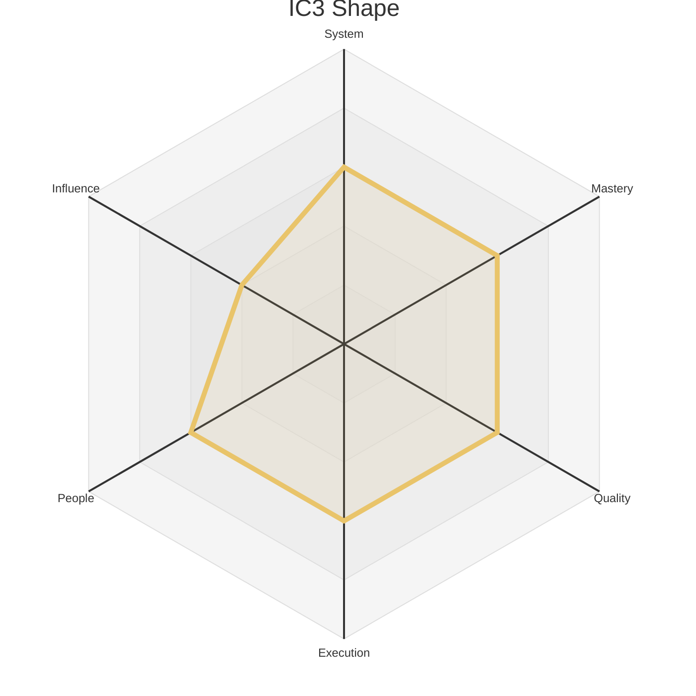
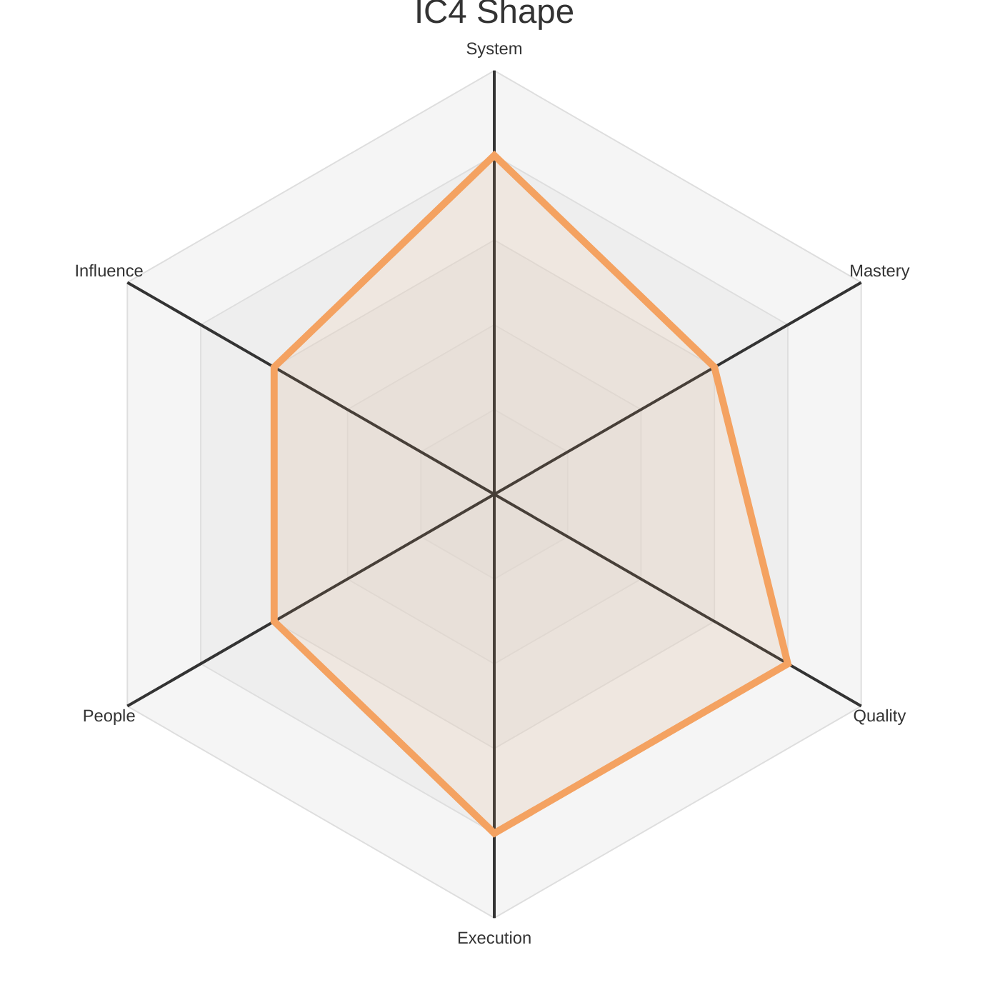
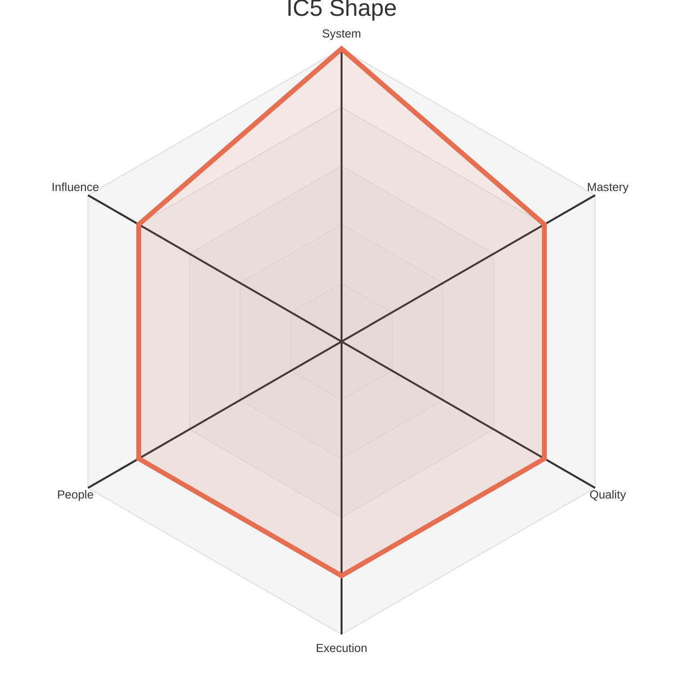

# Engineering Levels - Software Engineer

This document outlines the five Individual Contributor (IC) levels for a Software Engineer. Each level provides a summary of the expected scope and maps it to the corresponding levels on the six core axes defined in `axes.md`.

This structure clarifies that an engineer's overall level is a composite of their skills, which may develop at different paces. For example, a Staff Engineer may have a Level 4 in `System` but a Level 3 in `Influence`, reflecting their growing impact.

The radar chart below visualizes the expected competency shape at each of the five IC levels. Each level builds upon the last, showing how skills develop at different rates across our six core axes.

### Level 1: Junior Software Engineer (IC1)

*   **Summary:** A learner who **adopts** team practices and **enhances** the system through well-defined tasks under guidance. They are focused on growing their technical abilities and understanding of the team's context.

| Axis      | Level | Description                                                                                                                                                                                                                                                                                                                      |
| :-------- | :---- | :------------------------------------------------------------------------------------------------------------------------------------------------------------------------------------------------------------------------------------------------------------------------------------------------------------------------------- |
| System    | 1     | Focuses on understanding a specific part of the codebase, working on well-defined tasks with detailed specifications. Their mental model is localized to a single module or feature, and they require guidance to see how their changes connect to the broader system. Success means implementing tasks safely within their immediate scope.      |
| Mastery   | 1     | Learns the syntax and basic libraries of at least one programming language, along with fundamental debugging, testing, and version control. Focuses on applying established standards and team conventions with guidance, developing good habits in the process.                                                                                |
| Quality   | 1     | Produces functional code that meets the primary requirements, relying on code reviews and close feedback to improve clarity, testing, and maintainability. Their focus is on correctness for the "happy path," and they are learning to anticipate edge cases and write basic, effective tests.                                                       |
| Execution | 1     | Completes small, well-scoped tasks with close support and frequent communication. They are learning to break down problems into sequential steps, communicate progress effectively, and ask for help when blocked. Estimation and prioritization are developing skills.                                                                                |
| People    | 1     | Communicates clearly with teammates and remains open to feedback, seeking help when stuck. They build trust by being reliable, listening actively in team discussions, and responding to feedback with a constructive, growth-oriented mindset.                                                                                                 |
| Influence | 1     | Work primarily impacts their immediate module or tasks. Their sphere of influence is their own work, and success is defined by learning how their individual contributions fit into the team's larger goals.                                                                                                                                      |

### Level 2: Software Engineer (IC2)

*   **Summary:** A practitioner who **delivers** features independently and **masters** the team's core technologies, focusing on high-quality execution while still developing a broader understanding of systems and influence.

| Axis      | Level | Description                                                                                                                                                                                                                                                                                                                              |
| :-------- | :---- | :--------------------------------------------------------------------------------------------------------------------------------------------------------------------------------------------------------------------------------------------------------------------------------------------------------------------------------------- |
| System    | 1     | Focuses on understanding a specific part of the codebase, working on well-defined tasks with detailed specifications. Their mental model is localized to a single module or feature, and they require guidance to see how their changes connect to the broader system. Success means implementing tasks safely within their immediate scope.      |
| Mastery   | 2     | Independently builds features using common frameworks and libraries. They are proficient in the team's primary tools and languages, writing clean, idiomatic code and consistently applying conventions. They can debug moderately complex issues in familiar areas and understand basic performance and security considerations.                |
| Quality   | 2     | Consistently produces maintainable, well-tested, and clearly documented code that requires little rework. They anticipate straightforward edge cases, handle them gracefully, and view testing as an integral part of their development process, selecting the appropriate testing methods for their changes.                                          |
| Execution | 2     | Delivers small to medium features independently and reliably. Manages their own workload effectively, breaks down tasks, provides reasonable estimates, and communicates risks early. They can handle a moderate degree of ambiguity and consistently follow through on their commitments.                                                                |
| People    | 1     | Communicates clearly with teammates and remains open to feedback, seeking help when stuck. They build trust by being reliable, listening actively in team discussions, and responding to feedback with a constructive, growth-oriented mindset.                                                                                                 |
| Influence | 1     | Work primarily impacts their immediate module or tasks. Their sphere of influence is their own work, and success is defined by learning how their individual contributions fit into the team's larger goals.                                                                                                                                      |

### Level 3: Senior Software Engineer (IC3)

*   **Summary:** A system owner and mentor who **specializes** in key areas, **designs** robust features, and **supports** their teammates' growth. They have rounded out their skills to become a technical leader on their team.

| Axis      | Level | Description                                                                                                                                                                                                                                                                                                                            |
| :-------- | :---- | :----------------------------------------------------------------------------------------------------------------------------------------------------------------------------------------------------------------------------------------------------------------------------------------------------------------------------------------- |
| System    | 3     | Independently owns a subsystem or service, designing features that scale and operate reliably within its boundaries. They make thoughtful trade-offs between complexity, performance, and maintainability, author clear design documents, and proactively identify technical risks and debt before they become major problems.                    |
| Mastery   | 3     | Is recognized as an expert in one or more technical domains, such as backend APIs or frontend frameworks. They consistently balance performance, maintainability, and security in their solutions, and their peers seek their input on complex technical decisions, library choices, and debugging challenging issues.                          |
| Quality   | 3     | Produces robust, well-tested, and clear systems that serve as examples for others. They improve team practices by providing constructive, detailed feedback in reviews, anticipating subtle edge cases, and championing efforts to improve code clarity, test coverage, and comprehensive documentation.                                            |
| Execution | 3     | Reliably delivers medium to large projects from planning to production. They anticipate risks, mitigate blockers, and adapt plans as needed. Their ownership extends to ensuring the project is production-ready, well-documented, and sustainable, including stakeholder communication and managing dependencies.                                 |
| People    | 3     | Formally coaches teammates through pairing, thoughtful reviews, and knowledge-sharing sessions. Helps resolve team conflicts constructively, improves collaboration practices, and takes an active role in onboarding and supporting the growth of junior engineers.                                                                        |
| Influence | 2     | Contributions improve the team's productivity and the reliability of its services. They own components or processes that teammates depend on, and their work directly enables the team to achieve its goals more effectively.                                                                                                                     |

### Level 4: Staff Software Engineer (IC4)

*   **Summary:** A technical leader who **owns** major systems, **evangelizes** new technologies, and **orchestrates** complex projects across multiple teams. Their primary strengths are in system architecture and execution.

| Axis      | Level | Description                                                                                                                                                                                                                                                                                                                       |
| :-------- | :---- | :---------------------------------------------------------------------------------------------------------------------------------------------------------------------------------------------------------------------------------------------------------------------------------------------------------------------------------- |
| System    | 4     | Designs robust and scalable solutions that span multiple systems and teams. They anticipate future scaling, reliability, and security needs, aligning technical decisions with organizational architecture patterns. They influence other teams’ roadmaps to ensure a cohesive, long-term technical strategy.                             |
| Mastery   | 3     | Is recognized as an expert in one or more technical domains, such as backend APIs or frontend frameworks. They consistently balance performance, maintainability, and security in their solutions, and their peers seek their input on complex technical decisions, library choices, and debugging challenging issues.                          |
| Quality   | 4     | Introduces frameworks, automation, or practices that multiply quality across the team or department. They might build a CI/CD pipeline that prevents common errors or a library that makes secure coding the default. They proactively tackle technical debt and coach peers on testing, resilience, and clear design.                            |
| Execution | 4     | Coordinates and drives the delivery of complex projects across multiple contributors or teams. They align dependencies, manage priorities, and ensure consistent progress in the face of ambiguity. They are adept at decomposing large, unclear problems into actionable plans and keeping all stakeholders aligned.                          |
| People    | 3     | Formally coaches teammates through pairing, thoughtful reviews, and knowledge-sharing sessions. Helps resolve team conflicts constructively, improves collaboration practices, and takes an active role in onboarding and supporting the growth of junior engineers.                                                                        |
| Influence | 3     | Work shapes shared infrastructure, tools, or practices that benefit multiple teams. They provide guidance outside their immediate scope and own systems that create leverage for other engineers, establishing best practices that are adopted more broadly.                                                                                       |

### Level 5: Principal Software Engineer (IC5)

*   **Summary:** A technical strategist who **evolves** the organization's architecture, **innovates** on engineering practices, and **scales** their impact across the company, solving the most ambiguous and impactful problems.

| Axis      | Level | Description                                                                                                                                                                                                                                                                                                                            |
| :-------- | :---- | :--------------------------------------------------------------------------------------------------------------------------------------------------------------------------------------------------------------------------------------------------------------------------------------------------------------------------------------- |
| System    | 5     | Shapes the system architecture across entire domains, defining a long-term vision that connects technical strategy to business outcomes. They balance competing priorities, pioneer new architectural standards, and influence multiple teams to align on system-wide principles that enable future innovation.                              |
| Mastery   | 4     | Demonstrates broad, multi-faceted experience across various technologies and domains. They improve team productivity by creating or enhancing shared libraries, tools, and frameworks. They can rapidly evaluate new technologies with critical judgment and effectively troubleshoot the most complex, unfamiliar technical problems. |
| Quality   | 4     | Introduces frameworks, automation, or practices that multiply quality across the team or department. They might build a CI/CD pipeline that prevents common errors or a library that makes secure coding the default. They proactively tackle technical debt and coach peers on testing, resilience, and clear design.                            |
| Execution | 4     | Coordinates and drives the delivery of complex projects across multiple contributors or teams. They align dependencies, manage priorities, and ensure consistent progress in the face of ambiguity. They are adept at decomposing large, unclear problems into actionable plans and keeping all stakeholders aligned.                          |
| People    | 4     | Leads project teams by setting technical direction and managing contributors to achieve shared goals. They build consensus across groups, mediate disagreements, and actively support the growth of other mentors, fostering an inclusive environment and acting as a trusted voice in cross-functional forums.                                  |
| Influence | 4     | Defines standards, frameworks, or platforms that have a significant, positive impact on the entire engineering organization. Their technical decisions and leadership on cross-cutting initiatives shape the direction of a large group of engineers and deliver substantial business value.                                                      | 