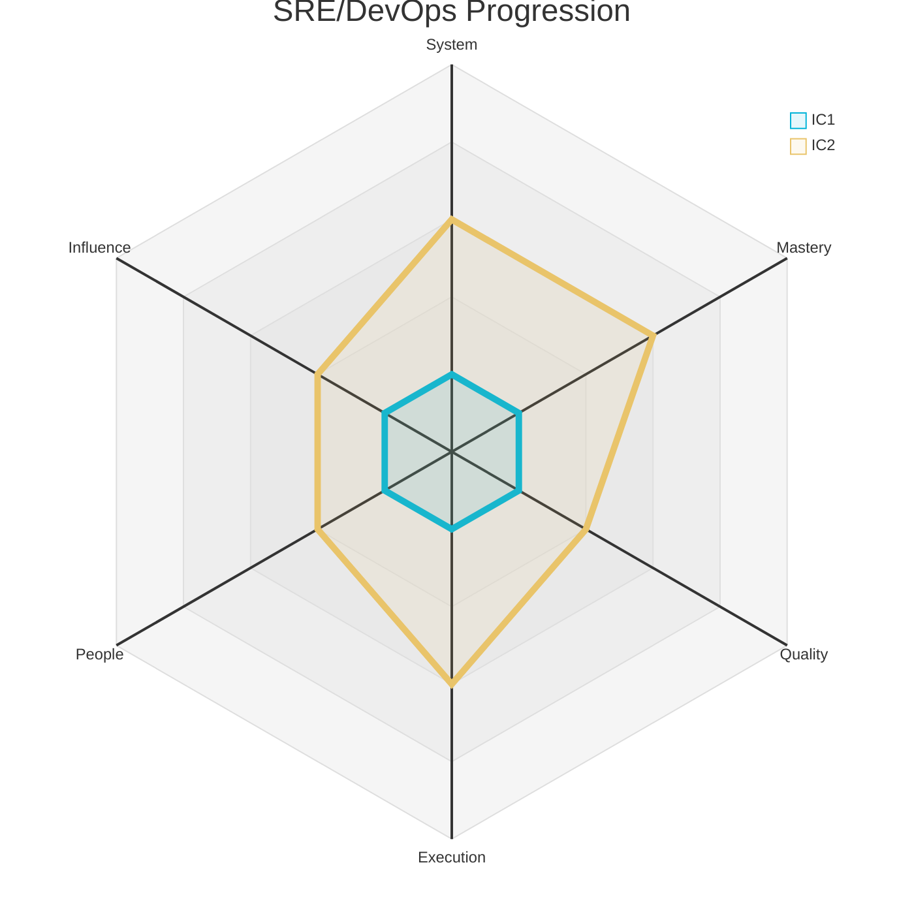
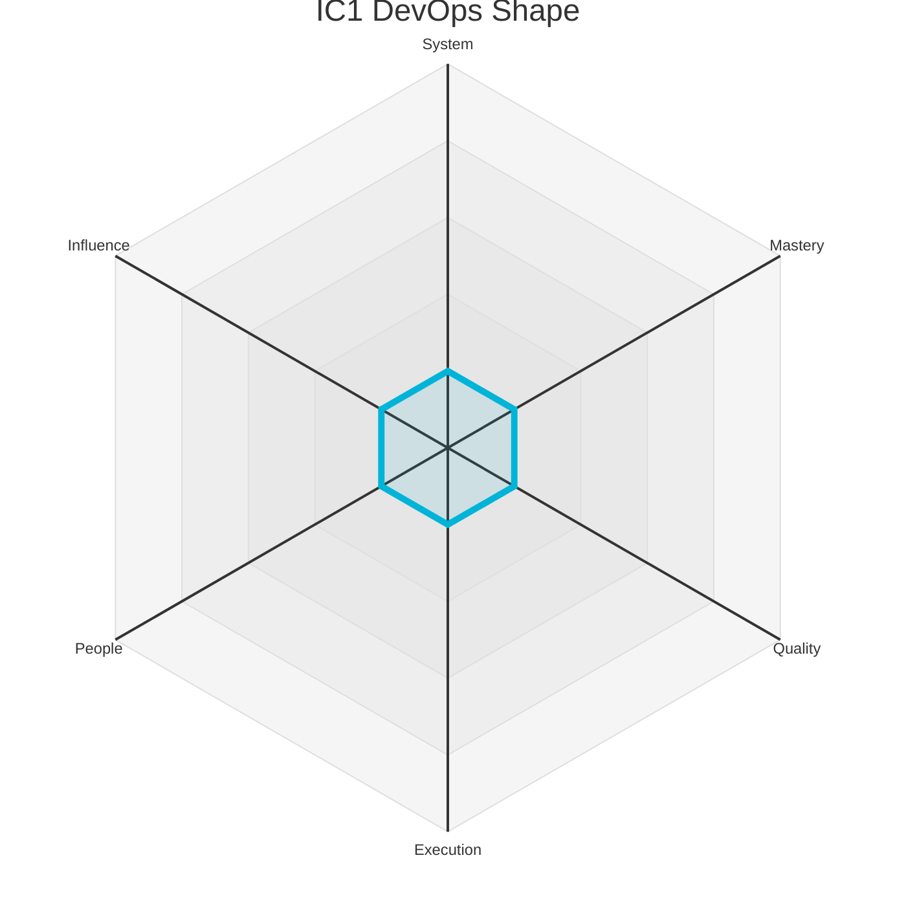
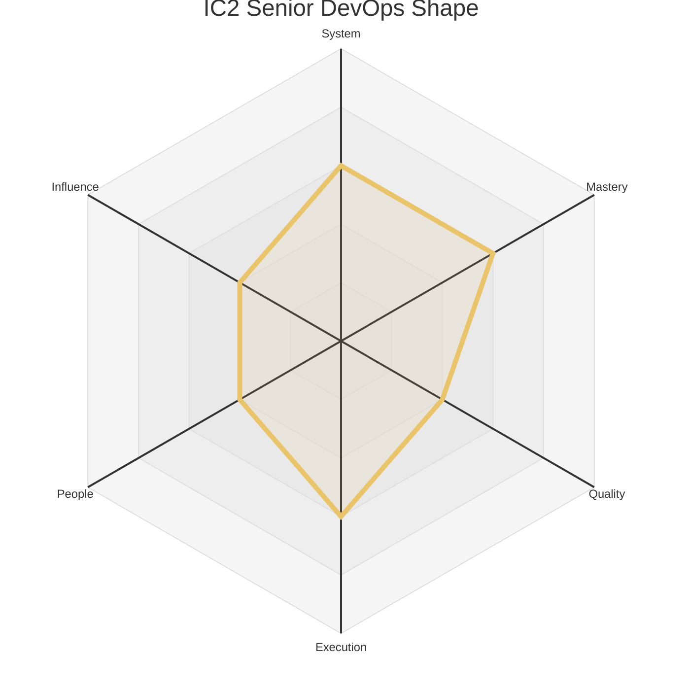

# Engineering Levels - SRE/DevOps Engineer

This document outlines the Individual Contributor (IC) levels for a SRE/DevOps Engineer. Each level provides a summary of the expected scope and maps it to the corresponding levels on the six core axes defined in `axes.md`.

The radar chart below visualizes the expected competency shape at each IC level.

### Level 1: DevOps Engineer (IC1)

*   **Summary:** A learner who **adopts** infrastructure practices and **enhances** systems by executing operational tasks and following documented procedures under guidance.

| Axis      | Level | Description                                                                                                                                                                                                                                                                                                                                     |
| :-------- | :---- | :------------------------------------------------------------------------------------------------------------------------------------------------------------------------------------------------------------------------------------------------------------------------------------------------------------------------------------------------ |
| System    | 1     | Learns a specific piece of infrastructure, like a CI job or an alerting rule, following established procedures for routine tasks. Their understanding is component-level, and they require guidance to grasp how their actions impact the broader production environment. Their focus is on executing tasks safely and correctly.                              |
| Mastery   | 1     | Learns the fundamentals of a core technology (e.g., Kubernetes, AWS) and a common scripting language (e.g., Bash, Python). Their focus is on mastering basic commands and concepts to execute routine operational tasks safely and consistently.                                                                                                   |
| Quality   | 1     | Follows documented procedures carefully to avoid errors, relying on review and automation to prevent mistakes in production changes. Their focus is on precision and consistency, ensuring that every operational task is performed according to best practice.                                                                                          |
| Execution | 1     | Completes routine operational tasks, such as handling alerts or running scripts, with guidance. They follow checklists and documented procedures to ensure correctness and are learning to manage their time effectively in a reactive environment.                                                                                                |
| People    | 1     | Communicates clearly with teammates and remains open to feedback, seeking help when stuck. They build trust by being reliable, listening actively in team discussions, and responding to feedback with a constructive, growth-oriented mindset.                                                                                                 |
| Influence | 1     | Work primarily impacts their immediate module or tasks. Their sphere of influence is their own work, and success is defined by learning how their individual contributions fit into the team's larger goals.                                                                                                                                      |

### Level 2: Senior DevOps Engineer (IC2)

*   **Summary:** An infrastructure owner who **designs** and **implements** robust automation to improve reliability and performance. They are a leader in operational excellence for their team.

| Axis      | Level | Description                                                                                                                                                                                                                                                                                                                              |
| :-------- | :---- | :--------------------------------------------------------------------------------------------------------------------------------------------------------------------------------------------------------------------------------------------------------------------------------------------------------------------------------------- |
| System    | 3     | Owns a complete infrastructure service, like the logging pipeline or a caching tier. They design and implement automation to improve its reliability, performance, and scalability, making informed trade-offs between cost and availability and proactively identifying operational risks within that service.                                      |
| Mastery   | 3     | Is an expert in a specific domain of infrastructure, such as observability, container orchestration, or networking. They apply this deep knowledge to optimize systems for performance, cost, and reliability, and are a go-to person for complex incident response in their area of expertise.                                                       |
| Quality   | 2     | Makes changes to production systems safely and reliably, with a clear understanding of the potential impact. They write clear documentation for operational procedures and contribute to improving existing runbooks. Their work is trusted to not cause incidents.                                                                                        |
| Execution | 3     | Leads the operational aspects of a major project, such as a service migration or a new product launch. They design and execute complex production changes with minimal risk, ensuring that the team is prepared for any potential issues. They own the operational readiness of the systems they support.                                              |
| People    | 2     | Actively participates in team rituals. Provides respectful, constructive feedback that helps teammates improve. Is a good pairing partner and informally shares knowledge, making the team more effective.                                                                                                                                   |
| Influence | 2     | Contributions improve the team's productivity and the reliability of its services. They own components or processes that teammates depend on, and their work directly enables the team to achieve its goals more effectively.                                                                                                                     | 