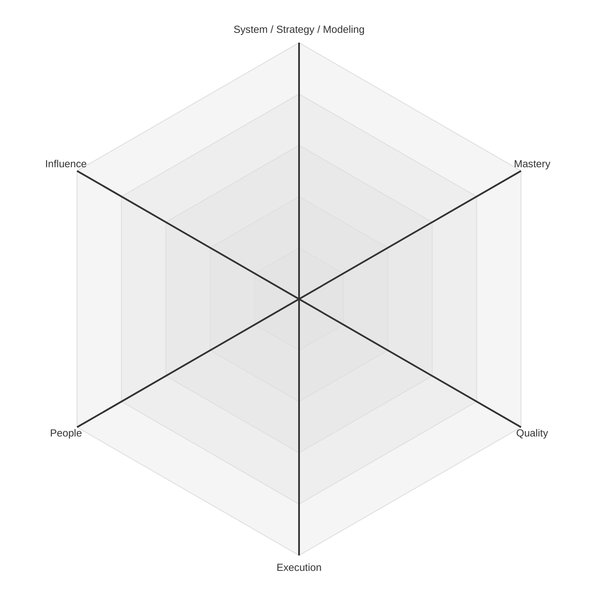
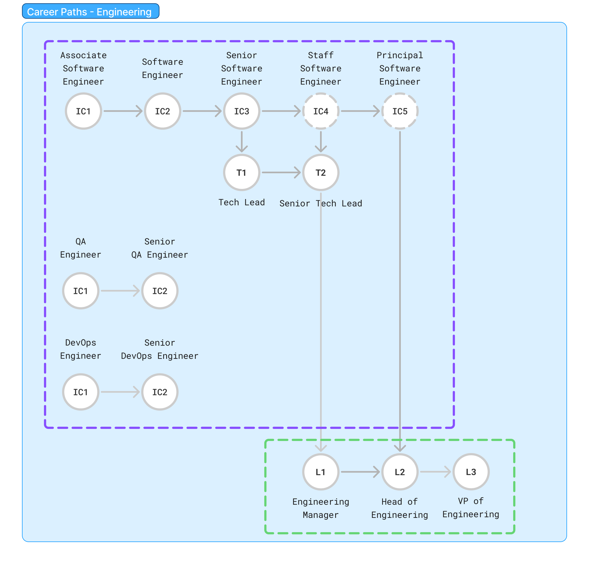
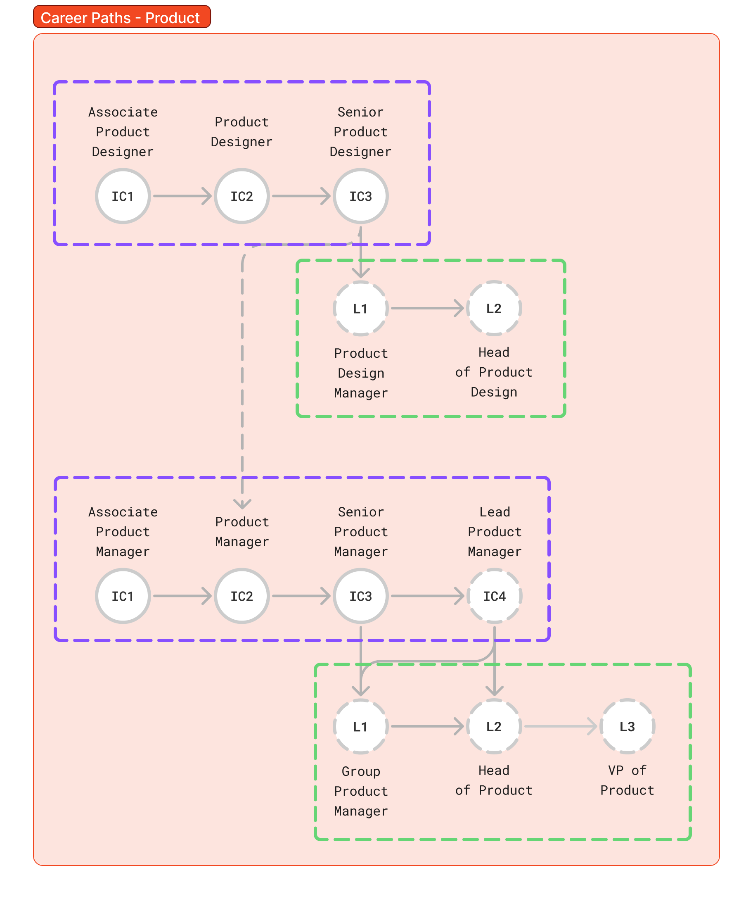
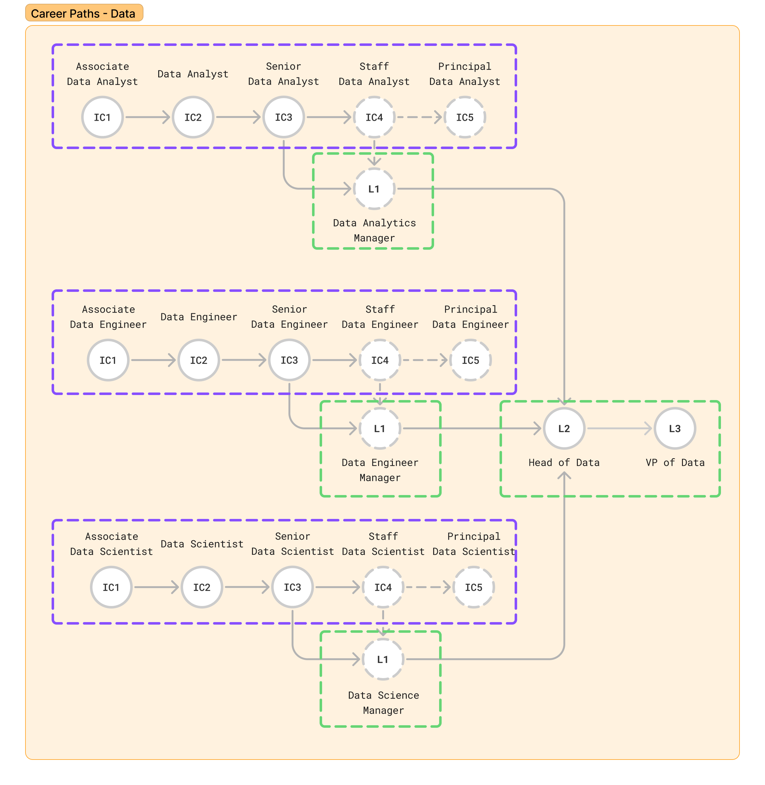

# Career Framework

This framework provides a clear and consistent guide for career progression across our **Engineering, Product, and Data** disciplines. It is designed to empower every team member to take ownership of their growth, understand what success looks like at each level, and see the path ahead.

Our goal is to support both deep technical mastery and strong people leadership, recognizing that both paths are essential to our success.

## Philosophy

Our approach to career growth is built on a few core principles:

1.  **Growth is Multi-faceted**: We don't believe in a one-size-fits-all ladder. Instead, we use six core **axes** of growth to describe the different dimensions of a role. This allows us to recognize and reward different "shapes" of talent.
2.  **Progression is Not Linear**: People develop skills at different rates. A Senior Engineer might be exceptional in `System` architecture but still developing their `Influence`. This framework is designed to reflect that reality, using radar charts to visualize each role's unique competency shape at every level.
3.  **Clarity and Transparency**: This framework aims to make expectations explicit. It is a shared language for talking about performance, feedback, and development goals between team members and their managers.
4.  **Discipline-Specific, Centrally Aligned**: While the core axes provide consistency, the specific behaviors and expectations are tailored to the unique demands of each discipline—Engineering, Product, and Data.

## The Six Axes

Growth is measured across six core axes. While the specific application of these axes is tailored to each discipline in their respective `axes.md` files, their high-level meaning is consistent across the company.

1.  **System / Strategy / Modeling**: This is the "what" and "why." It's about understanding the problem space, be it a technical system, a product strategy, or a data model. At senior levels, it's about defining the vision and architecture for the future.

2.  **Mastery**: This is the "how." It represents deep expertise in the craft and tools of a specific domain. It's about knowing the best practices, staying current with the industry, and demonstrating technical or creative excellence.

3.  **Quality**: This axis focuses on the standards of work. It's about accountability, attention to detail, and a commitment to delivering robust, elegant, and reliable outcomes, whether in code, design, or analysis.

4.  **Execution**: This is about getting things done. It represents the ability to deliver results, manage complexity, and operate with predictability and efficiency. It's about moving from idea to impact.

5.  **People**: This axis describes the ability to collaborate, communicate, and grow oneself and others. It's about mentorship, feedback, and contributing to a healthy, high-performing team culture. For managers, this is a primary focus.

6.  **Influence**: This axis measures the ripple effect of one's work. It's about the scope of impact, from an individual task to shaping a team's direction, the organization's strategy, or even the broader industry.

## Structure

The framework is organized by discipline. Each discipline has:

*   **An `axes.md` file**: This is the heart of the framework. It defines the six core axes of growth for the discipline and describes the specific behaviors and outcomes expected at each level for every role.
*   **A `levels` directory**: This directory contains detailed descriptions for each role's career path, including both Individual Contributor (IC) and Manager tracks. Each file provides level-by-level summaries, visualizations of the competency "shape," and a breakdown of expectations against each axis.

## Table of Contents

### Engineering

*   **[Axes](engineering/axes.md)**: Defines the core competencies for all Engineering roles.
*   **Levels**
    *   [Software Engineer](engineering/levels/software-engineer.md)
    *   [SRE/DevOps Engineer](engineering/levels/sre-devops.md)
    *   [QA Engineer](engineering/levels/qa.md)
    *   [Manager](engineering/levels/manager.md)

### Product

*   **[Axes](product/axes.md)**: Defines the core competencies for Product roles.
*   **Levels**
    *   [Product Manager](product/levels/product-manager.md)
    *   [Product Designer](product/levels/product-designer.md)
    *   [Manager](product/levels/manager.md)

### Data

*   **[Axes](data/axes.md)**: Defines the core competencies for all Data roles.
*   **Levels**
    *   [Data Analyst](data/levels/data-analyst.md)
    *   [Data Engineer](data/levels/data-engineer.md)
    *   [Data Scientist](data/levels/data-scientist.md)
    *   [Manager](data/levels/manager.md)

## Useful Links

*   [engineeringladders.com](https://engineeringladders.com)
*   [Basecamp's Titles for Programmers](https://github.com/basecamp/handbook/blob/master/titles-for-programmers.md)
*   [Remote Engineering Career Paths](https://remotecom.notion.site/Remote-Engineering-Career-Paths-998d7d0e0f8d45c7ba5f7f2d2da7a26f)
*   [Awesome Engineering Ladders](https://github.com/posquit0/awesome-engineering-ladders?tab=readme-ov-file#misc)
*   [Dropbox Engineering Career Framework](https://dropbox.github.io/dbx-career-framework/overview.html)
*   [Nidup's Engineering Career Ladders](https://www.nidup.io/garden/engineering-career-ladders)
*   [www.engineeringladders.com](https://www.engineeringladders.com/)
*   [career-ladders.dev](https://career-ladders.dev/engineering/)
*   [jorgef/engineeringladders on GitHub](https://github.com/jorgef/engineeringladders/tree/master)
*   [Etsy Engineering Career Ladder](https://etsy.github.io/Etsy-Engineering-Career-Ladder/)

This is a living framework that will evolve as our teams, roles, and the industry change.
