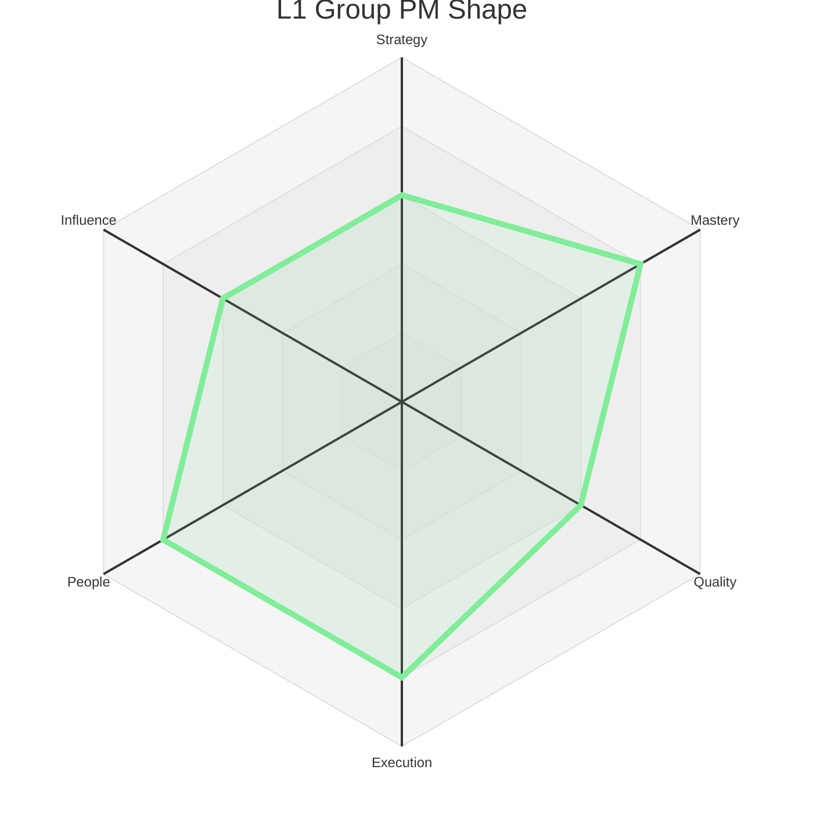
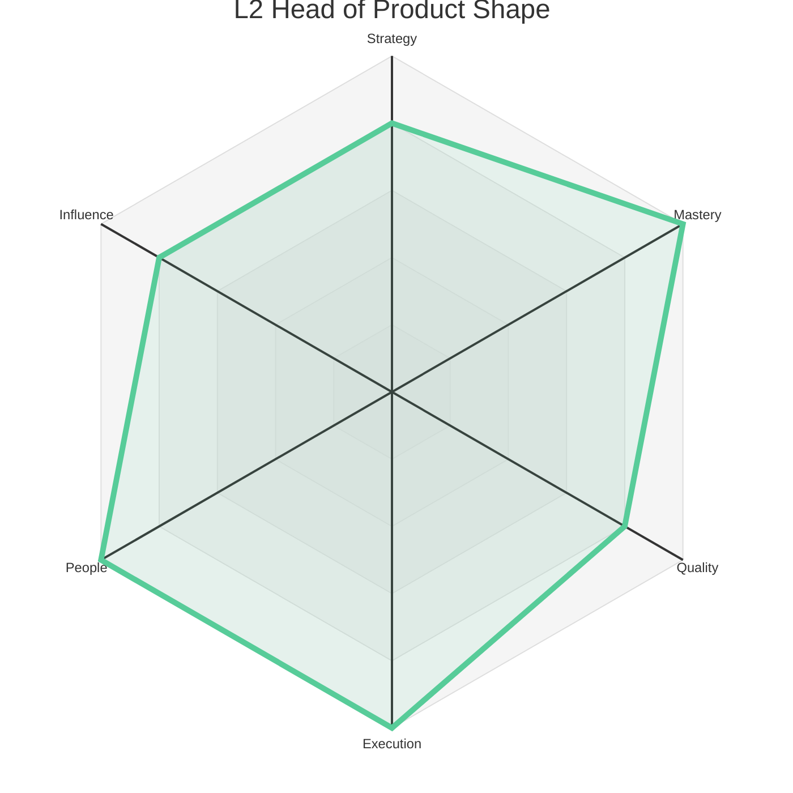
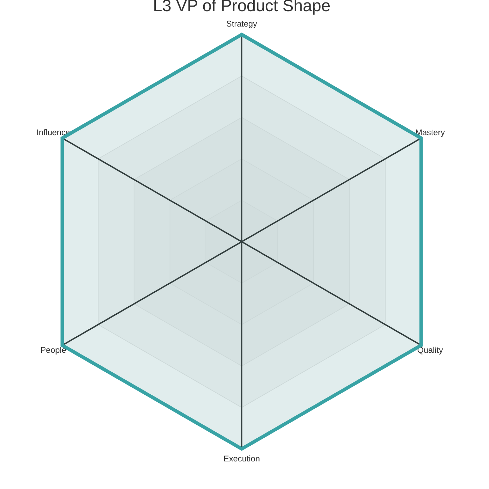
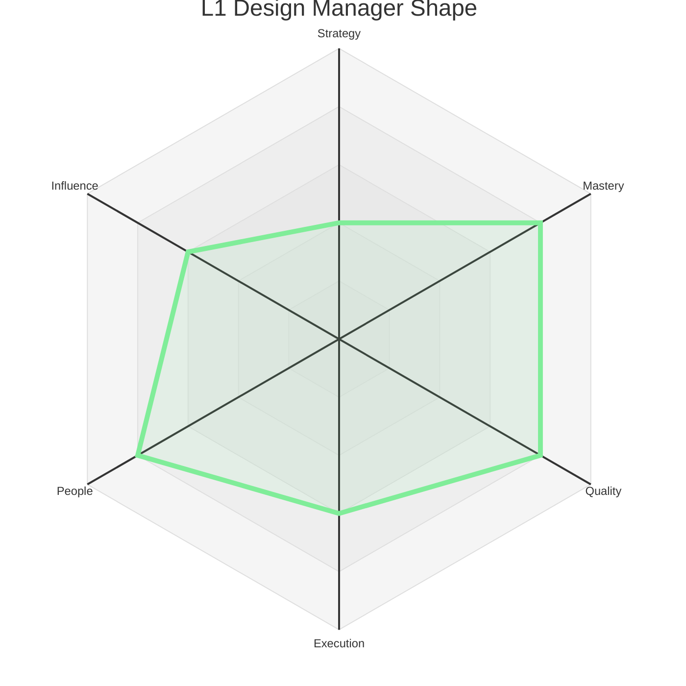
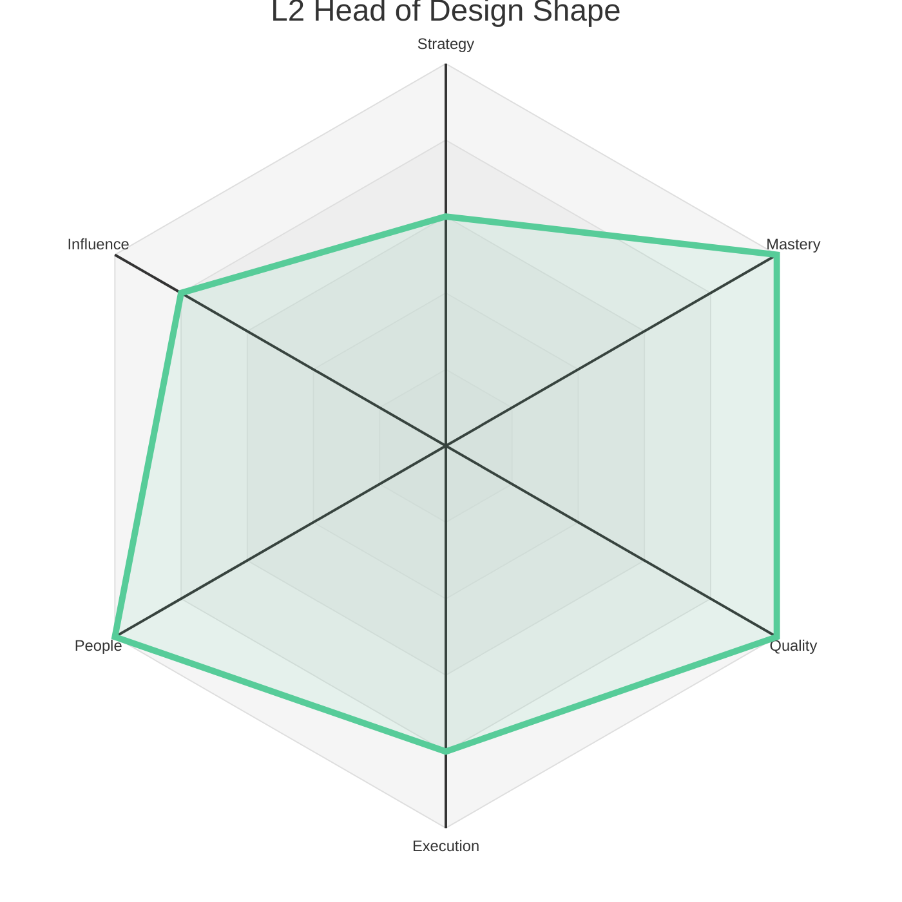

# Product Levels - Manager

This document outlines the Manager levels for the Product discipline. It is divided into two distinct tracks: **Product Management** and **Product Design Management**. Each level provides a summary of the expected scope and maps it to the core axes, adapted for a management context.

---

## Product Management Track

This track is for leaders who manage Product Managers and are responsible for the overall product strategy and execution.

### Level 1: Group Product Manager (L1)

*   **Summary:** A Group Product Manager **leads** a small group of Product Managers, focusing on their growth and the execution of a larger product area. They **own** their group's strategy, delivery, and culture.

| Axis     | Level | Description (Manager Context)                                                                                                                                                                                                                                                                                                                                                          |
| :------- | :---- | :------------------------------------------------------------------------------------------------------------------------------------------------------------------------------------------------------------------------------------------------------------------------------------------------------------------------------------------------------------------------------------- |
| Strategy | 3     | **(Product Area Strategy):** Defines the strategy for a meaningful product area. Creates a roadmap, sets goals, and makes prioritization trade-offs based on a deep understanding of user needs, business impact, and the competitive landscape. They are accountable for the success of their product area.                                                                                    |
| Mastery  | 4     | **(Developing PMs):** Is skilled at managing and developing other Product Managers. They are an effective coach on the core PM competencies and are learning the skills of a "manager of managers."                                                                                                                                                                                         |
| Quality  | 3     | **(Team's Quality Culture):** Fosters a culture of quality within their product group. They ensure their teams have effective processes for discovery, validation, and iteration. They are accountable for the user experience and business outcomes of their product area.                                                                                                                   |
| Execution| 4     | **(Group Delivery):** Ensures their group of teams executes and delivers on its commitments reliably. They are skilled at managing a portfolio of projects, navigating cross-team dependencies, and communicating progress to stakeholders.                                                                                                                                                |
| People   | 4     | **(People Growth):** Is dedicated to the growth and development of their PMs. They are an effective coach and mentor, helping their reports achieve their career goals. They are responsible for hiring and building a diverse, inclusive, and high-performing product team.                                                                                                                 |
| Influence| 3     | **(Group & Peers):** Effectively represents their product group to stakeholders across the company. They build strong relationships with their peers in engineering, design, and marketing and are a trusted partner in cross-functional collaborations.                                                                                                                                   |

### Level 2: Head of Product (L2)

*   **Summary:** A Head of Product **manages** multiple product teams and their managers. They **evolve** the broader product strategy and **adjust** organizational processes to scale the impact of their entire group.

| Axis     | Level | Description (Manager Context)                                                                                                                                                                                                                                                                                                                                                           |
| :------- | :---- | :-------------------------------------------------------------------------------------------------------------------------------------------------------------------------------------------------------------------------------------------------------------------------------------------------------------------------------------------------------------------------------------- |
| Strategy | 4     | **(Multi-Product Strategy):** Defines the strategy for a large, ambiguous product area that spans multiple teams or products. They identify new opportunities, influence other teams' roadmaps to achieve their goals, and can successfully pitch and secure investment in major new initiatives. They are a recognized strategic leader.                                                      |
| Mastery  | 5     | **(Organizational Leadership):** Has mastered the skills of managing PMs and is now leading a larger product organization. This includes managing other managers, organizational design, budget planning, and developing a leadership pipeline. They are a skilled organizational leader.                                                                                                   |
| Quality  | 4     | **(Group's Quality Culture):** Is responsible for the product quality and user experience outcomes of an entire group of teams. They identify and address systemic issues and sponsor initiatives that improve product excellence across their organization.                                                                                                                              |
| Execution| 5     | **(Group Delivery & Process):** Is accountable for the execution of an entire product group. They ensure that their organization has the right processes and tools to deliver on complex, cross-functional initiatives. They are skilled at managing a portfolio of products and making strategic trade-offs to maximize impact.                                                          |
| People   | 5     | **(Developing Leaders):** Is a "manager of managers." They are skilled at hiring, developing, and leading other managers. They are a steward of the product culture and are responsible for creating a healthy, inclusive, and high-performing environment for their entire group.                                                                                                      |
| Influence| 4     | **(Department & Leadership):** Has influence across the entire product and engineering organization. They are a key member of the product leadership team and contribute to defining the overall strategy and direction for the company. They are a trusted partner to senior cross-functional leaders.                                                                                     |

### Level 3: VP of Product (L3)

*   **Summary:** A VP of Product **leads** the entire product organization. They **create** the product vision and organizational structure that enables the company to achieve its long-term business goals.

| Axis     | Level | Description (Manager Context)                                                                                                                                                                                                                                                                                                                                                          |
| :------- | :---- | :------------------------------------------------------------------------------------------------------------------------------------------------------------------------------------------------------------------------------------------------------------------------------------------------------------------------------------------------------------------------------------- |
| Strategy | 5     | **(Company/Portfolio Strategy):** Defines the product strategy for an entire business unit or a significant portion of the company's product portfolio. They identify and evaluate major new market opportunities and play a key role in shaping the company's long-term business and product strategy. Their work has a significant impact on the company's future success.               |
| Mastery  | 5     | **(Executive Leadership):** Is an experienced product executive. They have mastered the skills of leading a large product organization and are a key member of the company's executive team. They are skilled at communicating a compelling vision, driving organizational change, and representing the company's product strategy to the board and external stakeholders.               |
| Quality  | 5     | **(Organizational Culture of Excellence):** Is the ultimate owner of the company's product quality and user experience. They foster a culture of product excellence and ensure that the organization is continuously improving its ability to ship high-quality, impactful products.                                                                                                       |
| Execution| 5     | **(Organizational Effectiveness):** Is responsible for the overall execution and effectiveness of the product organization. They ensure that the organization is structured and resourced to achieve the company's goals and that it is operating efficiently. They are a master of organizational design and product development processes.                                           |
| People   | 5     | **(Organizational Culture & Talent):** Is the steward of the product culture. They are responsible for creating an environment where talented PMs and leaders can thrive. They are the ultimate owner of the company's ability to attract, retain, and develop world-class product talent.                                                                                              |
| Influence| 5     | **(Company & Industry):** Has influence across the entire company and often in the broader product management industry. They are a key member of the executive team and help to shape the overall strategy of the company. They are a recognized leader in the industry and help to build the company's brand and reputation.                                                                |

---
---

## Product Design Management Track

This track is for leaders who manage Product Designers and are responsible for the overall design quality, strategy, and execution.

### Level 1: Product Design Manager (L1)

*   **Summary:** A Product Design Manager **leads** a team of designers, focusing on their growth, the team's execution, and the overall quality of the user experience.

| Axis     | Level | Description (Manager Context)                                                                                                                                                                                                                                                                                                                                                          |
| :------- | :---- | :------------------------------------------------------------------------------------------------------------------------------------------------------------------------------------------------------------------------------------------------------------------------------------------------------------------------------------------------------------------------------------- |
| Strategy | 2     | **(Team Strategy):** Understands and can articulate the strategy for their immediate team's product area. Connects their work to team-level objectives (e.g., OKRs) and can make trade-offs within a feature to better serve the team's goals.                                                                                                                                          |
| Mastery  | 4     | **(Developing Designers):** Is skilled at managing and developing Product Designers. They are an effective coach on the core design competencies (e.g., UX, UI, research) and are learning the skills of a "manager of managers."                                                                                                                                                           |
| Quality  | 4     | **(Team's Design Quality):** Is accountable for the design quality and user experience of their team's product area. They are a champion for high design standards, and they ensure the team has effective processes for design critique, user research, and maintaining a consistent design system.                                                                                           |
| Execution| 3     | **(Team Delivery):** Ensures the design team is executing effectively and delivering high-quality work on time. They partner closely with PM and Engineering managers to ensure a smooth and collaborative product development process.                                                                                                                                                 |
| People   | 4     | **(People Growth):** Is dedicated to the growth and development of their designers. They are an effective coach and mentor, helping their reports achieve their career goals. They are responsible for hiring and building a diverse, inclusive, and high-performing design team.                                                                                                          |
| Influence| 3     | **(Team & Peers):** Effectively represents the design team to its direct stakeholders. They build strong relationships with their peers in product and engineering and are a trusted partner in ensuring design has a strong voice in the product development process.                                                                                                                        |

### Level 2: Head of Product Design (L2)

*   **Summary:** A Head of Product Design **manages** multiple design teams and their managers. They **evolve** the company's design strategy and **scale** the design organization.

| Axis     | Level | Description (Manager Context)                                                                                                                                                                                                                                                                                                                                                           |
| :------- | :---- | :-------------------------------------------------------------------------------------------------------------------------------------------------------------------------------------------------------------------------------------------------------------------------------------------------------------------------------------------------------------------------------------- |
| Strategy | 3     | **(Product Area Strategy):** Defines the strategy for a meaningful product area. Creates a roadmap, sets goals, and makes prioritization trade-offs based on a deep understanding of user needs, business impact, and the competitive landscape. They are accountable for the success of their product area.                                                                                    |
| Mastery  | 5     | **(Organizational Leadership):** Has mastered the skills of managing designers and is now leading a larger design organization. This includes managing other managers, organizational design, and developing a leadership pipeline. They are a skilled organizational leader for the design function.                                                                                         |
| Quality  | 5     | **(Organizational Design Excellence):** Is responsible for the design quality and user experience for the entire company. They create and evangelize design systems and practices that ensure a high bar of quality and consistency. They are the ultimate owner of the company's design culture.                                                                                                |
| Execution| 4     | **(Group Delivery & Process):** Is accountable for the execution of the entire design organization. They ensure that their organization has the right processes and tools to deliver high-quality design work efficiently and effectively. They are skilled at managing a portfolio of design projects and making strategic trade-offs.                                                          |
| People   | 5     | **(Developing Leaders):** Is a "manager of managers." They are skilled at hiring, developing, and leading other design managers. They are a steward of the design culture and are responsible for creating a healthy, inclusive, and high-performing environment for their entire group.                                                                                                     |
| Influence| 4     | **(Department & Leadership):** Has influence across the entire product, design, and engineering organization. They are a key member of the product leadership team and contribute to defining the overall product and design strategy for the company. They are a trusted partner to senior cross-functional leaders.                                                                          | 