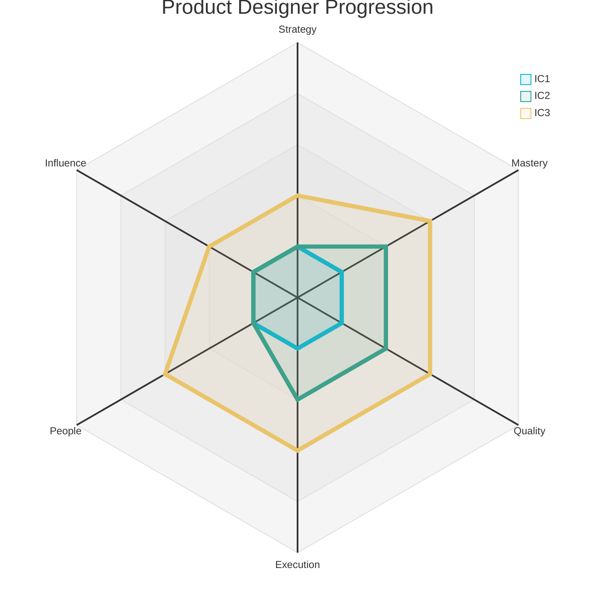
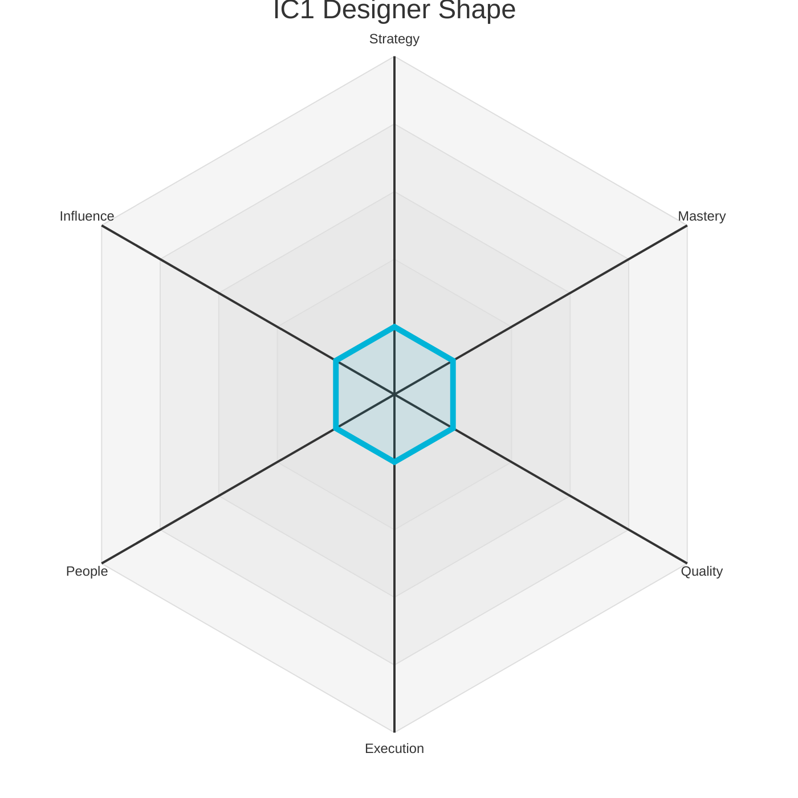
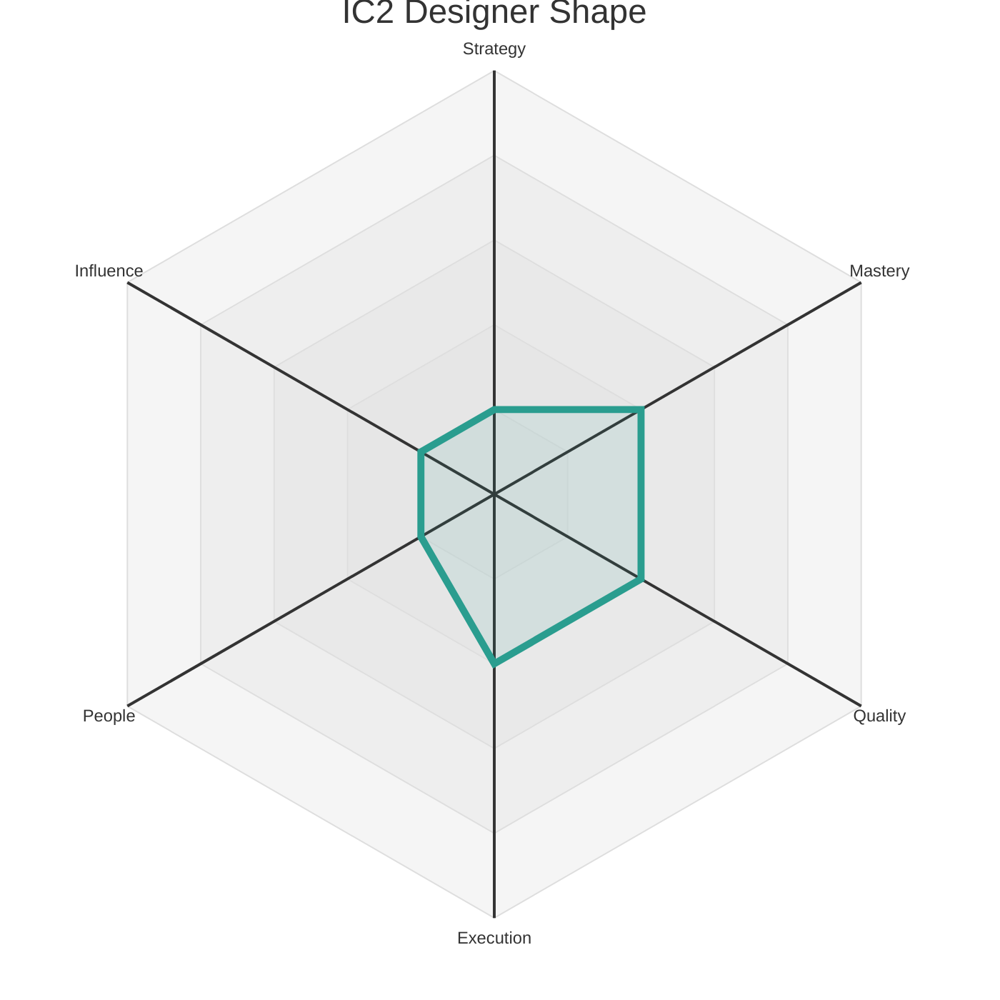
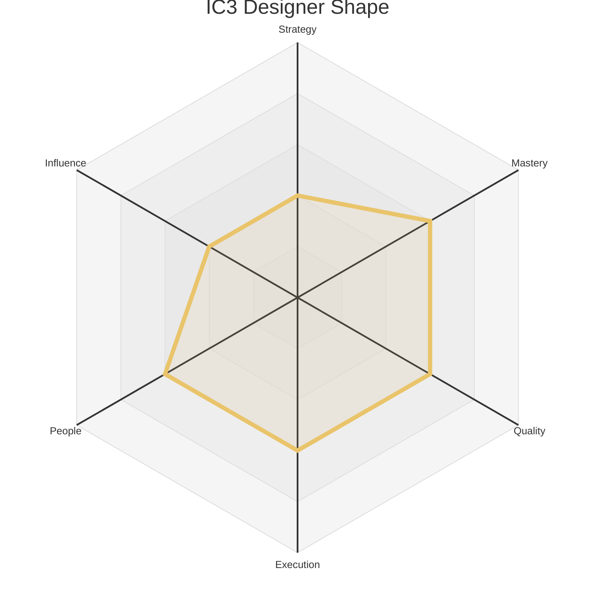

# Product Levels - Product Designer

This document outlines the three Individual Contributor (IC) levels for a Product Designer. Each level provides a summary of the expected scope and maps it to the corresponding levels on the six core axes defined in `axes.md`.

The radar chart below visualizes the expected competency shape at each of the three IC levels.

### Level 1: Associate Product Designer (IC1)

*   **Summary:** A learner who **adopts** the team's design process and **enhances** the product by producing high-quality design assets from well-defined specifications.

| Axis     | Level | Description                                                                                                                                                                                                                                                         |
| :------- | :---- | :------------------------------------------------------------------------------------------------------------------------------------------------------------------------------------------------------------------------------------------------------------------ |
| Strategy | 1     | **(Feature Strategy):** Understands and can articulate the goals for a well-defined feature. Focuses on understanding the "what" and "why" of a specific problem, relying on guidance from their manager or peers to connect their work to broader product or company goals. |
| Mastery  | 1     | Learns the fundamentals of design, including core design tools (e.g., Figma) and the principles of UI and UX design. Creates mockups and prototypes from detailed specifications with guidance.                                                                        |
| Quality  | 1     | **Product Designer:** Delivers polished designs that are free of errors and follow the established design system and brand guidelines.                                                                                                                                  |
| Execution| 1     | **Product Designer:** Delivers design assets on time and to spec. Is reliable and responsive in supporting the team's execution.                                                                                                                                       |
| People   | 1     | Communicates clearly with teammates and remains open to feedback, seeking help when stuck. They build trust by being reliable, listening actively in team discussions, and responding to feedback with a constructive, growth-oriented mindset.                      |
| Influence| 1     | Work primarily impacts their immediate tasks and the features they are assigned to. Their sphere of influence is their own work, and success is defined by learning how their individual contributions fit into the team's larger goals.                             |

### Level 2: Product Designer (IC2)

*   **Summary:** A practitioner who **delivers** high-quality designs independently and **masters** the end-to-end design process, from research to polished visual design.

| Axis     | Level | Description                                                                                                                                                                                                                                                         |
| :------- | :---- | :------------------------------------------------------------------------------------------------------------------------------------------------------------------------------------------------------------------------------------------------------------------ |
| Strategy | 1     | **(Feature Strategy):** Understands and can articulate the goals for a well-defined feature. Focuses on understanding the "what" and "why" of a specific problem, relying on guidance from their manager or peers to connect their work to broader product or company goals. |
| Mastery  | 2     | Is proficient in the end-to-end design process. Can independently conduct user research, create wireframes and prototypes, and deliver high-quality visual designs for new features. They are a reliable contributor to the design of their team's product.        |
| Quality  | 2     | **Product Designer:** Creates designs that are intuitive, easy to use, and aesthetically pleasing. They are a consistent advocate for the user's needs.                                                                                                               |
| Execution| 2     | **Product Designer:** Manages their own design work for features, ensuring that designs are delivered on time and that the team has what it needs to build them.                                                                                                       |
| People   | 1     | Communicates clearly with teammates and remains open to feedback, seeking help when stuck. They build trust by being reliable, listening actively in team discussions, and responding to feedback with a constructive, growth-oriented mindset.                      |
| Influence| 1     | Work primarily impacts their immediate tasks and the features they are assigned to. Their sphere of influence is their own work, and success is defined by learning how their individual contributions fit into the team's larger goals.                             |

### Level 3: Senior Product Designer (IC3)

*   **Summary:** A design owner who **specializes** in a complex domain, **designs** cohesive user experiences, and **supports** the growth of their teammates. They are a leader in design excellence on their team.

| Axis     | Level | Description                                                                                                                                                                                                                                                         |
| :------- | :---- | :------------------------------------------------------------------------------------------------------------------------------------------------------------------------------------------------------------------------------------------------------------------ |
| Strategy | 2     | **(Team Strategy):** Understands and can articulate the strategy for their immediate team's product area. Connects their work to team-level objectives (e.g., OKRs) and can make trade-offs within a feature to better serve the team's goals.                               |
| Mastery  | 3     | Owns the design for a complex product area. Creates and maintains design systems to ensure consistency and quality. Is an expert in a specific design domain, such as interaction design, visual design, or user research, and is a go-to person for other designers in that area. |
| Quality  | 3     | **Product Designer:** Creates elegant and cohesive user experiences that are a model for others. They are a champion for high design standards and help to raise the bar for design quality across the team.                                                          |
| Execution| 3     | **Product Designer:** Owns the design execution for large and complex projects. They are able to effectively manage their own time and the design process to ensure high-quality designs are delivered on time.                                                          |
| People   | 3     | Formally coaches teammates and other peers through thoughtful feedback, and knowledge-sharing sessions. Helps resolve team conflicts constructively, improves collaboration practices, and takes an active role in onboarding and supporting the growth of junior team members. |
| Influence| 2     | Contributions improve the team's ability to achieve its goals. They own features or parts of the design system that their teammates depend on, and their work directly enables the team to be more effective.                                                          | 