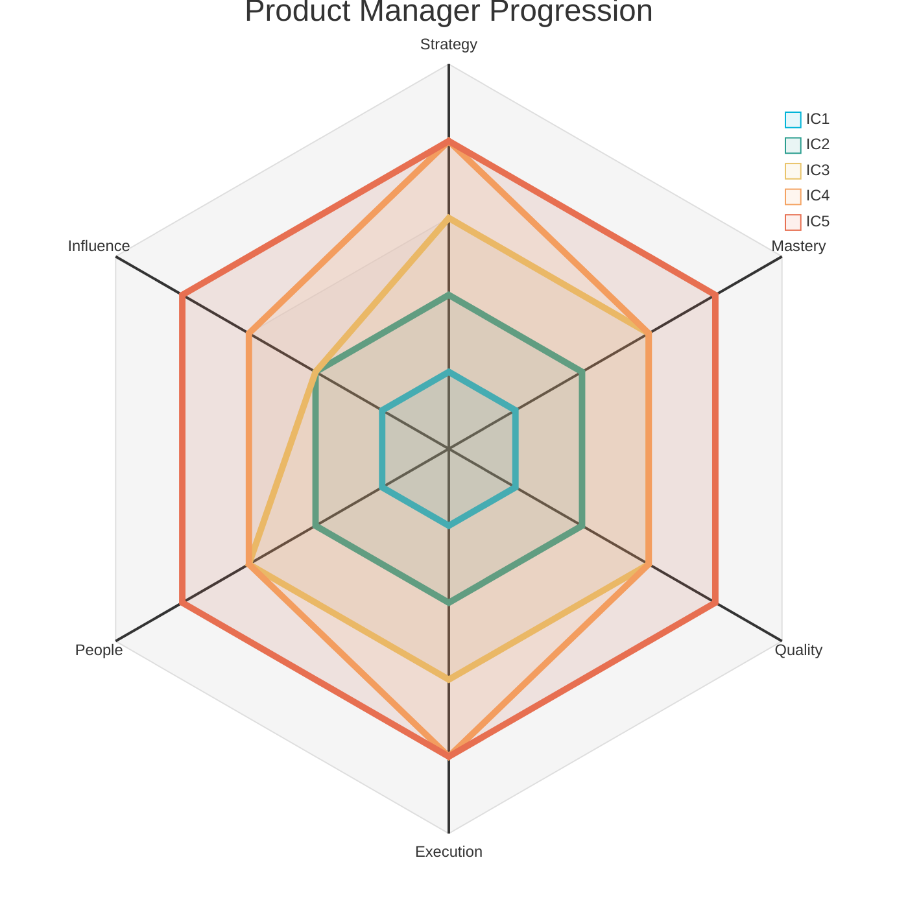
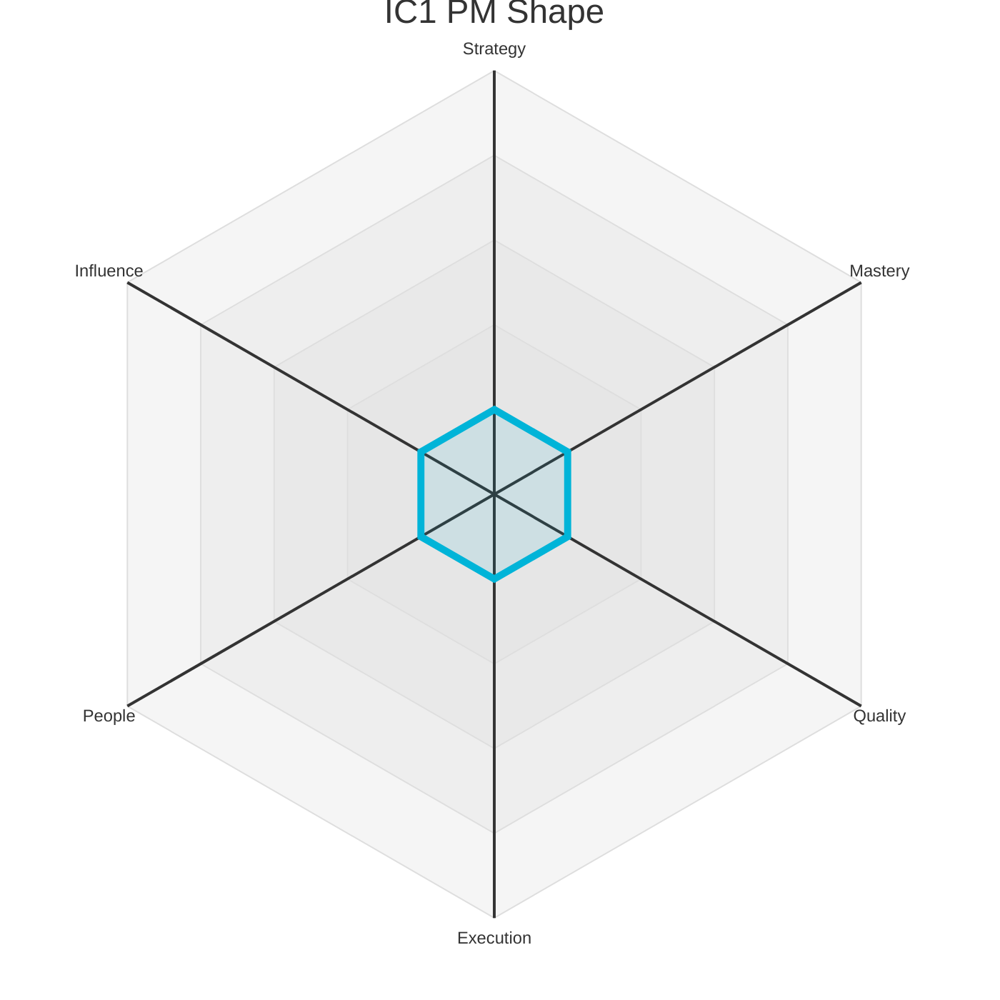
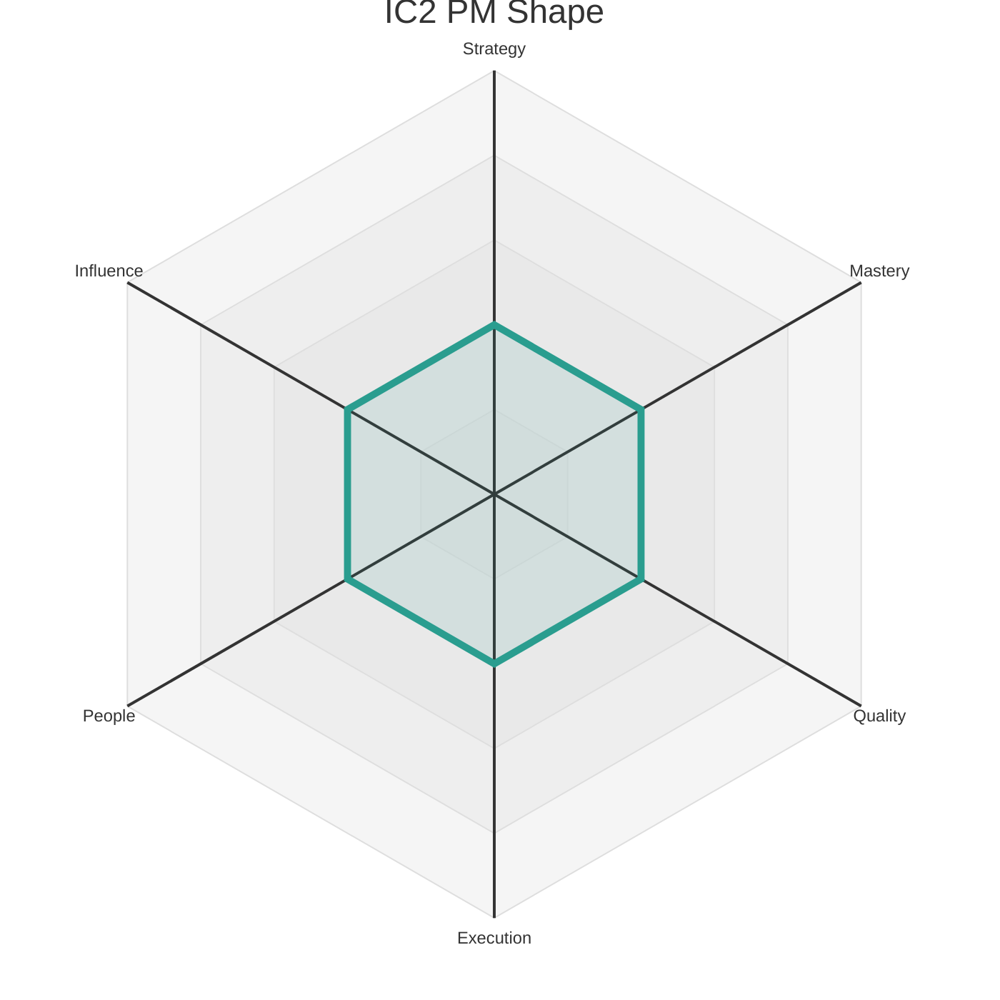
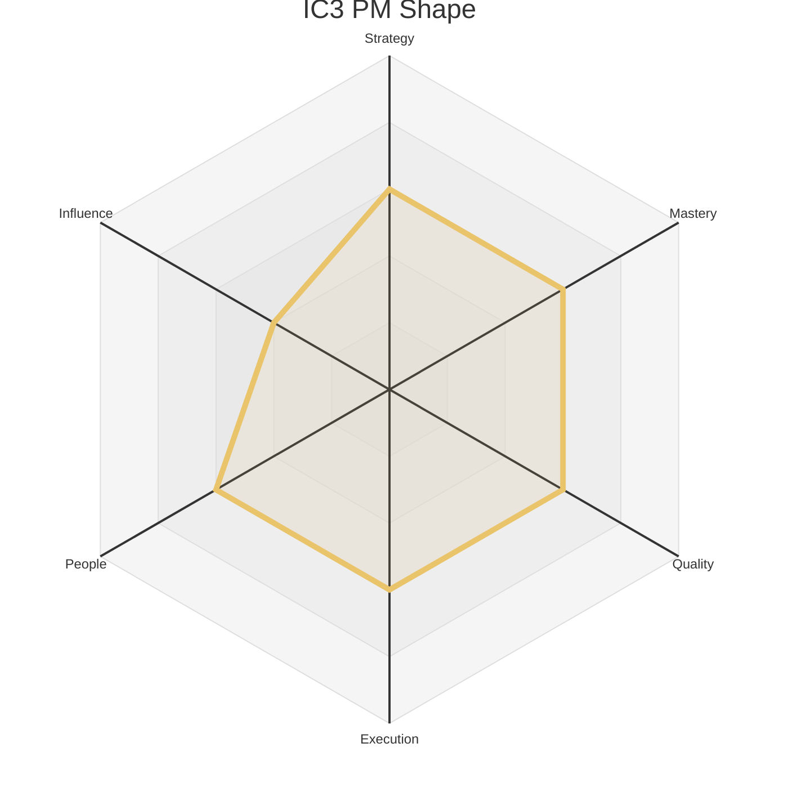
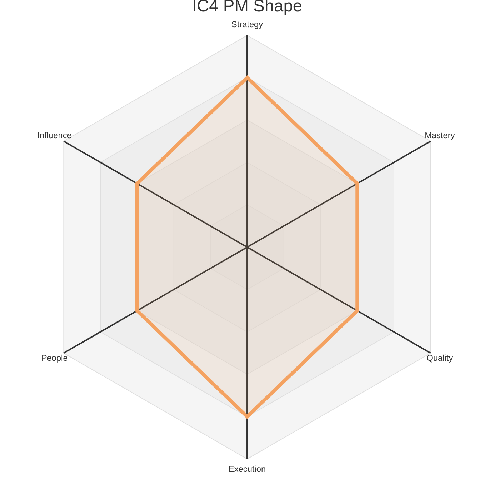
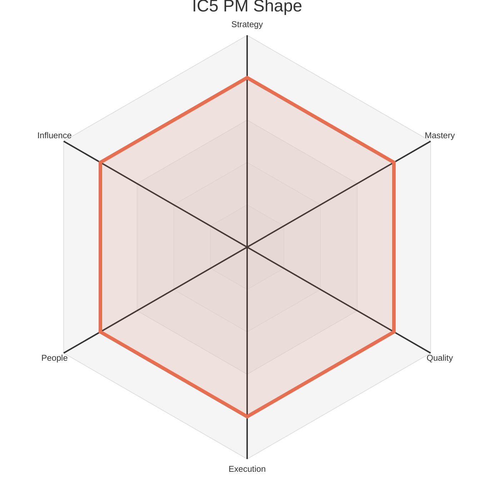

# Product Levels - Product Manager

This document outlines the five Individual Contributor (IC) levels for a Product Manager. Each level provides a summary of the expected scope and maps it to the corresponding levels on the six core axes defined in `axes.md`.

The radar chart below visualizes the expected competency shape at each of the five IC levels.

### Level 1: Associate Product Manager (IC1)

*   **Summary:** A learner who **adopts** team processes to **enhance** the product through well-defined features, focusing on developing core product management skills under guidance.

| Axis     | Level | Description                                                                                                                                                                                                                                                         |
| :------- | :---- | :------------------------------------------------------------------------------------------------------------------------------------------------------------------------------------------------------------------------------------------------------------------ |
| Strategy | 1     | **(Feature Strategy):** Understands and can articulate the goals for a well-defined feature. Focuses on understanding the "what" and "why" of a specific problem, relying on guidance from their manager or peers to connect their work to broader product or company goals. |
| Mastery  | 1     | Learns the fundamentals of product management, including writing clear user stories, managing a backlog, and working effectively with an engineering team. Focuses on developing core PM skills with guidance from their manager.                                     |
| Quality  | 1     | **Product Manager:** Writes clear and complete user stories that can be easily understood by the team. Ensures that acceptance criteria are well-defined.                                                                                                            |
| Execution| 1     | **Product Manager:** Effectively manages a backlog for small, well-defined tasks. Can clearly communicate the status of their work.                                                                                                                                 |
| People   | 1     | Communicates clearly with teammates and remains open to feedback, seeking help when stuck. They build trust by being reliable, listening actively in team discussions, and responding to feedback with a constructive, growth-oriented mindset.                      |
| Influence| 1     | Work primarily impacts their immediate tasks and the features they are assigned to. Their sphere of influence is their own work, and success is defined by learning how their individual contributions fit into the team's larger goals.                             |

### Level 2: Product Manager (IC2)

*   **Summary:** A reliable contributor who **delivers** features independently and **masters** the core skills of product management, ensuring their team solves the right problems for users.

| Axis     | Level | Description                                                                                                                                                                                                                                                         |
| :------- | :---- | :------------------------------------------------------------------------------------------------------------------------------------------------------------------------------------------------------------------------------------------------------------------ |
| Strategy | 2     | **(Team Strategy):** Understands and can articulate the strategy for their immediate team's product area. Connects their work to team-level objectives (e.g., OKRs) and can make trade-offs within a feature to better serve the team's goals.                               |
| Mastery  | 2     | Is proficient in the core skills of product management. Can independently lead a product discovery process, conduct user interviews, analyze data to inform decisions, and manage a backlog to ensure the team is building the right thing.                               |
| Quality  | 2     | **Product Manager:** Ensures that the features the team builds effectively solve the user's problem and meet the business goals.                                                                                                                                    |
| Execution| 2     | **Product Manager:** Works effectively with an engineering team to ship small-to-medium features in a predictable and timely manner.                                                                                                                                  |
| People   | 2     | Actively participates in team rituals. Provides respectful, constructive feedback that helps teammates improve. Is a good collaborator and informally shares knowledge, making the team more effective.                                                               |
| Influence| 2     | Contributions improve the team's ability to achieve its goals. They own features or parts of the design system that their teammates depend on, and their work directly enables the team to be more effective.                                                          |

### Level 3: Senior Product Manager (IC3)

*   **Summary:** A product owner who **specializes** in a complex domain, **designs** a product strategy for their area, and **supports** the growth of their team and peers.

| Axis     | Level | Description                                                                                                                                                                                                                                                         |
| :------- | :---- | :------------------------------------------------------------------------------------------------------------------------------------------------------------------------------------------------------------------------------------------------------------------ |
| Strategy | 3     | **(Product Area Strategy):** Defines the strategy for a meaningful product area. Creates a roadmap, sets goals, and makes prioritization trade-offs based on a deep understanding of user needs, business impact, and the competitive landscape. They are accountable for the success of their product area. |
| Mastery  | 3     | Is an expert in multiple product domains. Is highly skilled at complex prioritization, stakeholder management, and using a wide variety of quantitative and qualitative research methods to uncover user needs and business opportunities.                                 |
| Quality  | 3     | **Product Manager:** Is accountable for the overall success and user experience of their product area. They use data and user feedback to continuously improve the product and ensure it meets a high bar for quality.                                                |
| Execution| 3     | **Product Manager:** Reliably ships large and complex features and products from discovery to launch. They are skilled at managing dependencies, mitigating risks, and communicating with stakeholders.                                                              |
| People   | 3     | Formally coaches teammates and other peers through thoughtful feedback, and knowledge-sharing sessions. Helps resolve team conflicts constructively, improves collaboration practices, and takes an active role in onboarding and supporting the growth of junior team members. |
| Influence| 2     | Contributions improve the team's ability to achieve its goals. They own features or parts of the design system that their teammates depend on, and their work directly enables the team to be more effective.                                                          |

### Level 4: Lead Product Manager (IC4)

*   **Summary:** A product leader who **owns** a large, ambiguous product area, **evangelizes** a clear vision, and **orchestrates** execution across multiple teams to deliver significant business impact.

| Axis     | Level | Description                                                                                                                                                                                                                                                         |
| :------- | :---- | :------------------------------------------------------------------------------------------------------------------------------------------------------------------------------------------------------------------------------------------------------------------ |
| Strategy | 4     | **(Multi-Team/Product Strategy):** Defines the strategy for a large, ambiguous product area that spans multiple teams or products. They identify new opportunities, influence other teams' roadmaps to achieve their goals, and can successfully pitch and secure investment in major new initiatives. They are a recognized strategic leader. |
| Mastery  | 3     | Is an expert in multiple product domains. Is highly skilled at complex prioritization, stakeholder management, and using a wide variety of quantitative and qualitative research methods to uncover user needs and business opportunities.                                 |
| Quality  | 3     | **Product Manager:** Is accountable for the overall success and user experience of their product area. They use data and user feedback to continuously improve the product and ensure it meets a high bar for quality.                                                |
| Execution| 4     | **Product Manager:** Orchestrates the launch of complex, multi-team products. They are a master of project management and are able to keep many different streams of work on track.                                                                                 |
| People   | 3     | Formally coaches teammates and other peers through thoughtful feedback, and knowledge-sharing sessions. Helps resolve team conflicts constructively, improves collaboration practices, and takes an active role in onboarding and supporting the growth of junior team members. |
| Influence| 3     | Work shapes the direction of a product area or a significant part of the user experience. They provide guidance outside their immediate scope and own product strategies or design systems that create leverage for other teams, establishing best practices that are adopted more broadly. |

### Level 5: Principal Product Manager (IC5)

*   **Summary:** A product strategist who **evolves** the company's long-term vision, **innovates** on product practices, and **scales** their impact across the organization to solve the most critical business problems.

| Axis     | Level | Description                                                                                                                                                                                                                                                         |
| :------- | :---- | :------------------------------------------------------------------------------------------------------------------------------------------------------------------------------------------------------------------------------------------------------------------ |
| Strategy | 4     | **(Multi-Team/Product Strategy):** Defines the strategy for a large, ambiguous product area that spans multiple teams or products. They identify new opportunities, influence other teams' roadmaps to achieve their goals, and can successfully pitch and secure investment in major new initiatives. They are a recognized strategic leader. |
| Mastery  | 4     | Improves product management practices across the organization. They may mentor other PMs, introduce new processes or tools, or establish best practices. They are often a deep expert in a strategic area for the company, such as pricing, growth, or a core technology platform. |
| Quality  | 4     | **Product Manager:** Introduces processes and practices that improve product quality across the organization, such as creating a new framework for user feedback or a new process for A/B testing.                                                                    |
| Execution| 4     | **Product Manager:** Orchestrates the launch of complex, multi-team products. They are a master of project management and are able to keep many different streams of work on track.                                                                                 |
| People   | 4     | Leads project teams by setting clear direction and managing contributors to achieve shared goals. They build consensus across groups, mediate disagreements, and actively support the growth of other mentors, fostering an inclusive environment and acting as a trusted voice in cross-functional forums. |
| Influence| 4     | Defines strategies, standards, or platforms that have a significant, positive impact on the entire organization. Their decisions and leadership on cross-cutting initiatives shape the direction of a large group of product managers and designers and deliver substantial business value. | 